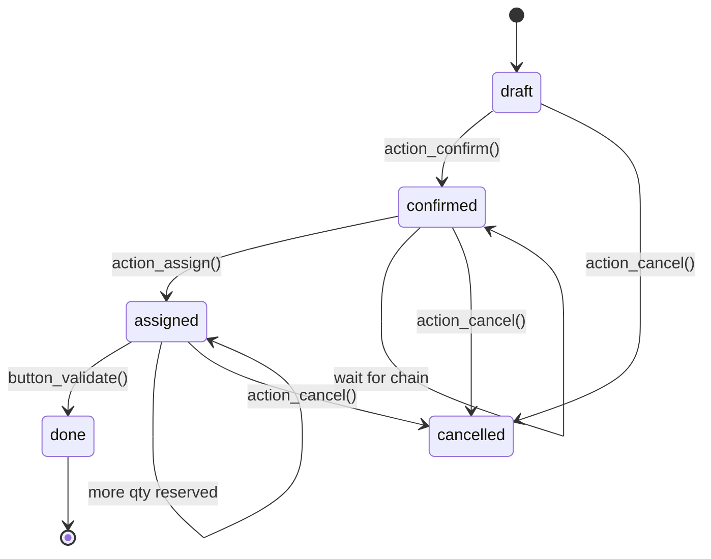
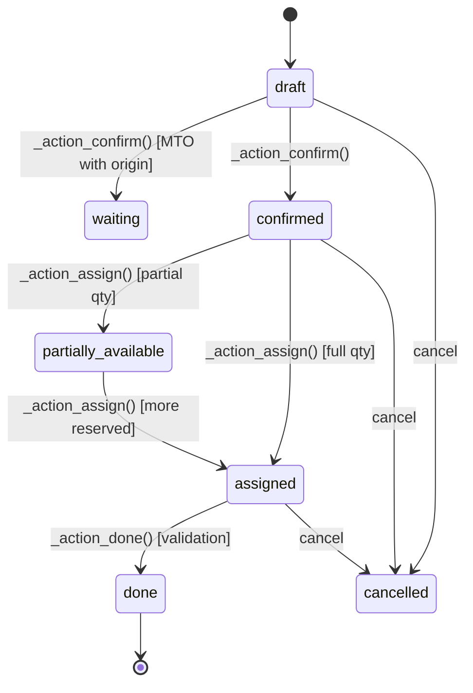

# Stock Module

Inventory and warehouse management — tracks products, lots, packages, and stock movements across warehouse locations. Core foundation for `sale_stock`, `purchase_stock`, `mrp`, and `stock_account`.

**Source:** `addons/stock/models/`
**Total model lines:** ~12,344 across 22 Python files

---

## Module Architecture

### Model Files

| File | Lines | Models |
|------|-------|--------|
| `stock_picking.py` | 1,744 | `stock.picking.type`, `stock.picking` |
| `stock_move.py` | 2,389 | `stock.move` (largest file) |
| `stock_quant.py` | 1,556 | `stock.quant`, `stock.quant.package` |
| `stock_warehouse.py` | 1,113 | `stock.warehouse` |
| `product.py` | 1,137 | `product.template` (stock mixin fields) |
| `stock_move_line.py` | 1,048 | `stock.move.line` |
| `stock_rule.py` | 698 | `stock.rule`, `procurement.group` |
| `stock_orderpoint.py` | 645 | `stock.warehouse.orderpoint` |
| `stock_scrap.py` | 220 | `stock.scrap` |
| `stock_package_level.py` | 214 | `stock.package.level` |
| `res_company.py` | 208 | `res.company` (stock settings) |
| `stock_location.py` | 527 | `stock.location`, `stock.route` |
| `stock_lot.py` | 360 | `stock.lot` |
| `stock_storage_category.py` | 68 | `stock.storage.category` |
| `stock_package_type.py` | 50 | `stock.package.type` |
| `res_config_settings.py` | 134 | `res.config.settings` |
| `barcode.py` | 20 | Barcode handlers |
| `ir_actions_report.py` | 16 | Report actions |
| `__init__.py` | 24 | Module imports |

---

## Core Domain Concepts

### The Quant System

`stock.quant` is the fundamental atomic record of inventory. Each quant is a 5-tuple:

```
(product_id, location_id, lot_id, package_id, owner_id) + quantity
```

- `quantity` > 0 means available stock
- `reserved_quantity` > 0 means stock earmarked for a future move
- `available_quantity` = quantity - reserved_quantity

Core quant operations:
- `_update_available_quantity()` — creates/updates quants; handles negative quants via `FOR NO KEY UPDATE SKIP LOCKED`
- `_update_reserved_quantity()` — reserves or unreserves quants for moves
- `_get_available_quantity()` — reads available qty (qty - reserved) for a 5-tuple
- `_gather()` — finds quants by product/location/lot/package/owner using removal strategy
- `_merge_quants()` — raw SQL deduplication in savepoint
- `_quant_tasks()` — calls `_merge_quants()` then `_unlink_zero_quants()`

### Reservation Flow

```
button_validate / _action_done
  └─> move._action_done()
        └─> _action_assign() on move
              └─> _update_reserved_quantity() on quant
                    └─> creates stock.move.line records
                          └─> decrement reserved_quantity on quants
```

### Validation Chain

```
button_validate() [picking L1134]
  └─> _pre_action_done_hook() [picking L1196]
        └─> _action_done() [picking L978]
              └─> move_ids._action_done() [move L1909]
                    └─> move_line_ids._action_done() [move_line L571]
                          └─> _update_available_quantity() on quants [quant L1074]
```

---

## stock.picking.type

**File:** `addons/stock/models/stock_picking.py` — `PickingType` class (line 20–379)

Operation type configuration. Each warehouse has 4 picking types (Receipt, Delivery, Internal Transfer, Pick). Stored in `stock.picking.type` with `code` selection.

### Key Fields

| Field | Type | Description |
|-------|------|-------------|
| `name` | Char | Operation type name (e.g., "Receipts") |
| `code` | Selection | `incoming` / `outgoing` / `internal` |
| `sequence_id` | Many2one | Auto-numbering sequence (`WH/IN/00001`) |
| `sequence` | Integer | Priority for listing |
| `default_location_src_id` | Many2one | Default source location |
| `default_location_dest_id` | Many2one | Default destination location |
| `company_id` | Many2one | Owning company |
| `warehouse_id` | Many2one | Associated warehouse |
| `use_create_lots` | Boolean | Allow creating lots/serials |
| `use_existing_lots` | Boolean | Allow selecting existing lots |
| `print_label` | Boolean | Print SSCC label on validation |
| `show_entire_packs` | Boolean | Enable whole-pack reservation |
| `reservation_method` | Selection | `at_confirm` / `manual` / `by_date` |
| `reservation_days_before` | Integer | Days before due date to reserve |
| `reservation_days_before_priority` | Integer | Days before priority due date to reserve |
| `create_backorder` | Selection | `ask` / `always` / `never` |
| `auto_print_delivery_report` | Boolean | Auto-print picking report |
| `auto_print_reception_report` | Boolean | Auto-print incoming report |
| `auto_print_return_report` | Boolean | Auto-print return report |

### Picking Type Codes

- `incoming`: Receipt from supplier / return from customer
- `outgoing`: Delivery to customer / return to supplier
- `internal`: Warehouse transfers

`reservation_method` controls when quants are reserved:
- `at_confirm`: Reserve immediately on picking confirmation
- `manual`: Only reserve when user clicks "Check Availability"
- `by_date`: Reserve `reservation_days_before` days before scheduled date

---

## stock.picking

**File:** `addons/stock/models/stock_picking.py` — `Picking` class (line 382–1745)

Transfer document. Groups `stock.move` records for a single operation. Can represent a receipt, delivery, or internal transfer.

### Key Fields

| Field | Type | Description |
|-------|------|-------------|
| `name` | Char | Reference (auto-generated via sequence) |
| `state` | Selection | `draft / waiting / confirmed / assigned / done / cancel` |
| `picking_type_id` | Many2one | Operation type |
| `user_id` | Many2one | Assigned responsible |
| `company_id` | Many2one | Owning company |
| `partner_id` | Many2one | Partner address |
| `owner_id` | Many2one | Goods owner (consignment) |
| `location_id` | Many2one | Source location |
| `location_dest_id` | Many2one | Destination location |
| `move_ids` | One2many | Stock moves (`stock.move`) |
| `move_line_ids` | One2many | Detailed operation lines (`stock.move.line`) |
| `group_id` | Many2one | Procurement group |
| `backorder_id` | Many2one | Parent picking if backorder |
| `backorder_ids` | One2many | Child backorders |
| `origin` | Char | Document origin (e.g., SO name) |
| `priority` | Selection | `0`=Normal, `1`=Urgent |
| `scheduled_date` | Datetime | Scheduled date/time |
| `date_deadline` | Datetime | Latest allowed date |
| `date_done` | Datetime | Actual completion timestamp |
| `has_packages` | Boolean | Computed: picking uses packages |
| `show_check_availability` | Boolean | Show availability button |
| `show_allocation` | Boolean | Show allocation button |
| `note` | Html | Internal notes |
| `operation_ids` | One2many | Pack operations (legacy) |
| `picked` | Boolean | All lines marked as picked |

### Picking State Machine

```
draft ──(action_confirm)──> confirmed/waiting
                               │
    ┌──────────────────────────┴──────────────────────┐
    ▼                                                  ▼
confirmed ──(action_assign)──> assigned          waiting ──(move dependency resolved)──> confirmed
    │                                                          │
    └────────────────(cancel)─────────────────────────────────> cancel
                                     │
                                     ▼
                              (button_validate)──> done
```

**State meanings:**
- `draft`: Created, not confirmed, no moves processed
- `waiting`: Waiting on another operation (MTO chain, move dependencies not resolved)
- `confirmed`: Confirmed, waiting for stock availability
- `assigned`: All stock reserved, ready to validate
- `done`: Validated, quants updated
- `cancel`: Cancelled, quants not affected

### Key Methods

#### `action_confirm()` — line 926

Confirms the picking, triggers move confirmation, runs procurement scheduler.

```python
def action_confirm(self):
    # Confirms all moves linked to this picking
    self.move_ids.filtered(lambda m: m.state == 'draft')._action_confirm()
    # Trigger procurement for any pending rules
    self.env['procurement.group'].run_scheduler()
    return True
```

#### `action_assign()` — line 936

Public API for checking stock availability. Triggers `_action_assign()` on all moves.

```python
def action_assign(self):
    for picking in self:
        picking.move_ids._action_assign()
    return True
```

#### `_action_done()` — line 978

Picking-level completion. Delegates to moves and handles owner restriction.

```python
def _action_done(self):
    # Filter for non-cancelled, non-done moves
    todo_moves = self.move_ids.filtered(
        lambda m: m.state in ('draft', 'waiting', 'partially_available',
                              'assigned', 'confirmed')
    )
    cancel_backorder = self.env.context.get('cancel_backorder', False)

    # Delegate to move-level _action_done which handles split + quant updates
    todo_moves._action_done()

    # Write completion metadata
    self.write({
        'date_done': fields.Datetime.now(),
        'priority': '0',
    })

    # Handle owner restriction: if picking has owner_id, validate as that owner
    for picking in self:
        if picking.owner_id and picking.owner_id != picking.company_id.partner_id:
            picking.move_ids.write({'restrict_partner_id': picking.owner_id.id})

    # Send confirmation emails
    for picking in self:
        picking._send_confirmation_email()
```

#### `_pre_action_done_hook()` — line 1196

Runs before `_action_done()`. Sets picked flag, handles backorder wizard.

```python
def _pre_action_done_hook(self):
    if not self.move_ids:
        raise UserError(_("Nothing to process."))

    # Mark all picked if not already
    if not self.picked:
        self.move_ids.filtered(lambda m: m.state not in ('done', 'cancel')).picked = True

    # Launch backorder detection wizard if needed
    if self.picking_type_id.create_backorder in ('ask', 'always'):
        return self._action_generate_backorder_wizard()
    return True
```

#### `_check_backorder()` — line 1251

Determines if a backorder is needed by checking if any moves are partially done.

```python
def _check_backorder(self):
    for picking in self:
        picking_type = picking.picking_type_id
        if picking_type.create_backorder == 'never':
            return False
        if picking_type.create_backorder == 'always':
            return True
        # 'ask': only create backorder if moves are partially done
        return any(
            move.state in ('partially_available', 'assigned')
            and float_compare(move.quantity_done, 0,
                              precision_rounding=move.product_uom.rounding) > 0
            for move in picking.move_ids
        )
```

#### `_create_backorder()` — line 1294

Creates a new picking as a backorder of the current one.

```python
def _create_backorder(self):
    backorders = self.env['stock.picking']
    for picking in self:
        # Copy picking, set backorder_id, unlink done moves from copy
        backorder_vals = picking.copy_data({
            'name': '/',
            'move_ids': [],
            'move_line_ids': [],
            'backorder_id': picking.id,
        })[0]
        backorder = self.create(backorder_vals)
        picking.move_ids.filtered(lambda m: m.state == 'done')\
                        .move_line_ids.write({'picking_id': backorder.id})
        picking.move_ids.write({'picking_id': backorder.id})
        backorder.action_assign()
        backorders |= backorder
    return backorders
```

#### `_sanity_check()` — line 1090

Validates before validation — ensures no empty pickings, tracked products have lot/serial assigned, quantities correct.

```python
def _sanity_check(self):
    for picking in self:
        if not picking.move_ids:
            raise UserError(_("Cannot validate a transfer without stock moves."))
        for move in picking.move_ids:
            if move.state == 'cancel':
                continue
            if move.product_id.tracking != 'none' and move.state not in ('draft', 'cancel'):
                if not move.move_line_ids.filtered(lambda ml: ml.lot_id):
                    raise UserError(_("Products are tracked. Please specify a Lot/Serial number."))
```

#### `_put_in_pack()` — line 1500

Packages selected move lines into a `stock.quant.package`.

```python
def _put_in_pack(self):
    # Creates stock.quant.package from selected move lines
    # Creates stock.package.level for reservation tracking
    # Returns action to open the package
```

#### `action_cancel()` — line 1078

Cancels the picking and unlinks move lines, freeing reserved quantities.

```python
def action_cancel(self):
    self.move_ids._do_unreserve()
    self.move_ids.write({'state': 'cancel', 'move_line_ids': [(5,)]})
```

#### `action_toggle_is_locked()` — line 1721

Toggles the `is_locked` field (preventing edits after done).

```python
def action_toggle_is_locked(self):
    self.filtered(lambda p: p.state == 'done').is_locked = not self.is_locked
```

---

## stock.move

**File:** `addons/stock/models/stock_move.py` (2,389 lines)

The core engine of stock movement. A move represents a single stock transfer from one location to another. Multiple moves are grouped inside a `stock.picking`.

### Key Fields

| Field | Type | Description |
|-------|------|-------------|
| `name` | Char | Move description |
| `state` | Selection | `draft / waiting / confirmed / partially_available / assigned / done / cancel` |
| `picking_id` | Many2one | Parent picking |
| `product_id` | Many2one | Product being moved |
| `product_uom_qty` | Float | Quantity to move (in product's UoM) |
| `quantity_done` | Float | Quantity actually done |
| `product_uom` | Many2one | Unit of measure |
| `location_id` | Many2one | Source location |
| `location_dest_id` | Many2one | Destination location |
| `company_id` | Many2one | Owning company |
| `procure_method` | Selection | `make_to_stock` / `make_to_order` / `mts_else_mto` |
| `group_id` | Many2one | Procurement group |
| `origin` | Char | Document origin |
| `partner_id` | Many2one | Partner |
| `picking_type_id` | Many2one | Operation type |
| `restrict_partner_id` | Many2one | Restrict quants to this owner |
| `route_ids` | Many2many | Route rules |
| `warehouse_id` | Many2one | Target warehouse |
| `date` | Datetime | Scheduled date |
| `date_deadline` | Datetime | Latest allowed date |
| `priority` | Selection | `0`=Normal, `1`=Urgent |
| `sequence` | Integer | Priority in picking |
| `scrapped` | Boolean | Move is a scrap |
| `is_inventory` | Boolean | Inventory adjustment move |
| `move_line_ids` | One2many | Operation lines |
| `move_orig_ids` | Many2many | Moves this depends on |
| `move_dest_ids` | Many2many | Moves depending on this |
| `propagate_cancel` | Boolean | Propagate cancellation to dependent moves |
| `bom_line_id` | Many2one | BOM line reference (for manufacturing) |
| `orderpoint_id` | Many2one | Minimum stock rule that triggered this |
| `description_picking` | Char | Picking description override |
| `allowed_route_ids` | Many2many | Routes that can be used |

### Move State Machine

```
draft ──(_action_confirm)──> waiting/confirmed
                               │
    ┌──────────────────────────┴──────────────────────────────┐
    ▼                                                          ▼
confirmed ──(_action_assign)──> partially_available ──(_action_assign)──> assigned
    │                                        (more qty reserved)             │
    │                                                                          │
    └──────────────────(cancel)───────────────────────────────────────────────> cancel
                                         │
                                         ▼
                                  (button_validate)──> done
```

### Procure Method

- `make_to_stock` (MTS): Pull from on-hand stock
- `make_to_order` (MTO): Create a procurement to buy/produce the product
- `mts_else_mto`: Use MTS if stock available, otherwise MTO

### Key Methods

#### `_action_confirm()` — line 1376

Confirms draft or waiting moves. Handles MTO procurement creation.

```python
def _action_confirm(self, merge=False, merge_into=False):
    # 1. Confirm draft/waiting moves by writing state='confirmed'
    # 2. For MTO moves with no source move, create procurement
    # 3. Propagate date/deadline from procurement group
    # 4. If merge=True, merge with existing confirmed moves of same product/location
    move_to_confirm = self.filtered(lambda m: m.state in ('draft', 'waiting'))
    move_to_confirm.write({'state': 'confirmed'})
    # MTO procurement creation
    for move in move_to_confirm:
        if move.procure_method == 'make_to_order' and not move.move_orig_ids:
            self.env['procurement.group'].run([move])
```

#### `_action_assign()` — line 1670

Main reservation method. Full batching logic with recursive call support.

```python
def _action_assign(self):
    """Reserves stock for moves. Returns True if fully reserved."""
    assigned_moves = self.env['stock.move']
    partially_available_moves = self.env['stock.move']

    # Process moves in order (priority + date)
    for move in self.filtered(lambda m: m.state in ('confirmed', 'waiting', 'partially_available')):
        if move.product_id.type != 'product':
            move.write({'state': 'assigned'})
            assigned_moves |= move
            continue

        # _update_reserved_quantity creates/updates stock.move.line records
        # Returns (reserved, total_needed, max_quantity)
        reserved, total_needed, max_quantity = move._update_reserved_quantity(
            move.product_id, move.location_id, total_needed,
            move.product_uom, origin=move, lot_id=move.lot_id,
            package_id=move.package_id, owner_id=move.restrict_partner_id
        )

        if float_compare(total_needed, reserved, precision_rounding=move.product_uom.rounding) == 0:
            assigned_moves |= move
        elif reserved > 0:
            partially_available_moves |= move
        else:
            pass  # remains confirmed
```

#### `_update_reserved_quantity()` — line 1530

Creates `stock.move.line` records and reserves quants. Called by `_action_assign()`.

```python
def _update_reserved_quantity(self, product_id, location_id, quantity, product_uom,
                              origin=False, lot_id=False, package_id=False, owner_id=False):
    """Returns (reserved_qty, total_demand, max_available)."""
    # 1. Call _gather() on stock.quant to get available quants
    # 2. For each quant, call _update_reserved_quantity() (quant level)
    # 3. Create stock.move.line records to track the reservation
    # 4. Returns total reserved across all quants
```

#### `_do_unreserve()` — line 811

Unlinks move lines and frees reserved quantities.

```python
def _do_unreserve(self):
    for move in self:
        move.move_line_ids.unlink()
    # stock.quant reserved_quantity is restored by unlink cascade
```

#### `_action_done()` — line 1909

**THE core validation method.** This is the main entry point called when a picking is validated.

```python
def _action_done(self, cancel_backorder=False):
    # STEP 1: Confirm all draft/waiting moves
    moves = self.filtered(lambda m: m.state == 'draft')
    moves._action_confirm(merge=False)

    # STEP 2: Cancel non-picked moves where qty_done <= 0 or cancel_backorder=True
    moves_to_cancel = self.filtered(
        lambda m: m.state != 'cancel' and float_compare(m.quantity_done, 0,
                   precision_rounding=m.product_uom.rounding) <= 0
    )
    if cancel_backorder:
        moves_to_cancel.write({'state': 'cancel', 'move_line_ids': [Command.clear()]})
    else:
        moves_to_cancel.write({'state': 'cancel'})

    # STEP 3: Unlink move lines for cancelled moves
    self.filtered(lambda m: m.state == 'cancel').move_line_ids.unlink()

    # STEP 4: Create extra moves for over-quantity (qty_done > product_uom_qty)
    extra_moves = self.filtered(
        lambda m: m.state != 'cancel'
        and float_compare(m.quantity_done, m.product_uom_qty,
                          precision_rounding=m.product_uom.rounding) > 0
    )
    for move in extra_moves:
        extra_qty = move.quantity_done - move.product_uom_qty
        move._split(extra_qty)  # creates new move for excess qty
        move.quantity_done = move.product_uom_qty  # reset to planned

    # STEP 5: Split moves for backorder (quantity_done < product_uom_qty)
    moves_to_split = self.filtered(
        lambda m: m.state != 'cancel'
        and float_compare(m.quantity_done, 0,
                          precision_rounding=m.product_uom.rounding) > 0
        and float_compare(m.quantity_done, m.product_uom_qty,
                          precision_rounding=m.product_uom.rounding) < 0
    )
    backorder_moves = moves_to_split._split(moves_to_split.quantity_done)
    backorder_moves.write({'state': 'confirmed'})

    # STEP 6: Call _action_done() on all remaining done move lines
    # (this moves the quants)
    done_mls = self.move_line_ids.filtered(
        lambda ml: ml.state != 'cancel'
        and float_compare(ml.quantity, 0,
                          precision_rounding=ml.product_uom_id.rounding) > 0
    )
    done_mls._action_done()

    # STEP 7: Unlink zero-quantity quants
    self.env['stock.quant']._unlink_zero_quants()

    # STEP 8: Update move state to done
    self.write({'state': 'done', 'date': fields.Datetime.now()})

    # STEP 9: Trigger chained moves (move_dest._action_assign())
    for move in self:
        move.move_dest_ids.filtered(
            lambda m: m.state in ('waiting', 'confirmed')
        )._action_assign()

    # STEP 10: Create backorder picking if needed
    for move in self:
        if move.picking_id and move.picking_id._check_backorder():
            move.picking_id._create_backorder()

    # STEP 11: Run _check_quantity() on done moves (validates SN tracking)
    for move in self:
        move.move_line_ids.filtered(lambda ml: ml.lot_id)._check_quantity()
```

#### `_push_apply()` — line 963

Triggers push rules after move completion. Called at end of move validation.

```python
def _push_apply(self):
    for move in self:
        if move.dest_location_id:
            rule = move.product_id._get_push_rules_from_location(move.dest_location_id)
            if rule:
                rule._run_push(move.dest_location_id, move)
```

#### `_merge_moves()` — line 1050

Deduplicates moves with the same product/location/partner/route before processing.

```python
def _merge_moves(self, merge_into=False):
    # Groups moves by key: (product_id, location_id, location_dest_id,
    #                       partner_id, picking_id, route_id, priority, company_id)
    # Sums product_uom_qty for merged moves
    # Keeps the move with most detail (e.g., with lot/serial)
```

#### `_split()` — line 2017

Splits a move at a given quantity. Used for backorders.

```python
def _split(self, qty):
    """Split move at qty. Returns the new move for the remaining quantity."""
    # Creates a new move record copying original but with remaining qty
    # Original move keeps qty, new move gets the rest
    # Handles move lines and propagate to move_dest relationships
```

#### `action_show_details()` — line 2558

Opens the detailed operation view (form view for move lines).

#### `_prepare_merge_sorted_fields()` — line 1021

Returns grouping key for `_merge_moves()`. Ensures moves with different lot_id/package_id/owner_id don't merge.

---

## stock.move.line

**File:** `addons/stock/models/stock_move_line.py` (1,048 lines)

Detailed operation records. One move line per lot/package/owner combination. Tracks the specific detail of what is being moved.

### Key Fields

| Field | Type | Description |
|-------|------|-------------|
| `move_id` | Many2one | Parent stock.move |
| `picking_id` | Many2one | Parent stock.picking |
| `product_id` | Many2one | Product |
| `product_uom_id` | Many2one | Unit of measure |
| `quantity` | Float | Quantity (in product_uom_id) |
| `quantity_product_uom` | Float | Quantity in product's default UoM |
| `picked` | Boolean | Marked as picked by user |
| `location_id` | Many2one | Source location |
| `location_dest_id` | Many2one | Destination location |
| `lot_id` | Many2one | Lot/Serial number |
| `lot_name` | Char | Lot name (for creation) |
| `package_id` | Many2one | Source package |
| `result_package_id` | Many2one | Destination package |
| `owner_id` | Many2one | Goods owner |
| `company_id` | Many2one | Owning company |
| `is_inventory` | Boolean | This is an inventory adjustment |
| `description_picking` | Char | Line description |
| `package_level_id` | Many2one | Package level for entire-package reservation |
| `state` | Selection | `draft / assigned / done / cancel` |
| `reference` | Char | Reference to quant/package |
| `work_order_id` | Many2one | Work order (for MTO) |

### Key Methods

#### `create()` — line 341

Creates move lines. Automatically reserves quants for confirmed/done moves.

```python
@api.model_create_multi
def create(self, vals_list):
    for vals in vals_list:
        # Set company_id from move/picking context if not specified
        if not vals.get('company_id'):
            move_id = self.env['stock.move'].browse(vals.get('move_id'))
            if move_id:
                vals['company_id'] = move_id.company_id.id
            else:
                picking_id = self.env['stock.picking'].browse(vals.get('picking_id'))
                if picking_id:
                    vals['company_id'] = picking_id.company_id.id

        # Pick up picked flag from context or move
        if not vals.get('picked'):
            move_id = self.env['stock.move'].browse(vals.get('move_id'))
            if move_id.picked:
                vals['picked'] = True

    return super().create(vals_list)
```

#### `_action_done()` — line 571

**Moves quants.** Subtracts from source location, adds to destination location.

```python
def _action_done(self):
    # STEP 1: Validate lot/SN assignments for tracked products
    # - If use_create_lots: create lot if lot_name provided and not found
    # - If use_existing_lots: require lot_id to be set
    # - Raise UserError if tracked product without lot

    # STEP 2: Get quants cache for products/locations involved
    quants_cache = self.env['stock.quant']._get_quants_cache_by_products_locations(
        self.product_id, self.location_id | self.location_dest_id,
        extra_domain=['|', ('lot_id', 'in', self.lot_id.ids), ('lot_id', '=', False)]
    )

    # STEP 3: For each move line, call _synchronize_quant()
    for ml in self:
        # Free any over-reserved quantity at source
        ml._synchronize_quant(-ml.quantity_product_uom, ml.location_id, action="reserved")
        # Remove from source location
        available_qty, in_date = ml._synchronize_quant(
            -ml.quantity_product_uom, ml.location_id, in_date=in_date
        )
        # Add to destination location
        ml._synchronize_quant(
            ml.quantity_product_uom, ml.location_dest_id,
            package=ml.result_package_id, in_date=in_date
        )
        # If source goes negative, free other reservations
        if available_qty < 0:
            ml._free_reservation(ml.product_id, ml.location_id,
                                  abs(available_qty), lot_id=ml.lot_id,
                                  package_id=ml.package_id, owner_id=ml.owner_id)
```

#### `_synchronize_quant()` — line 678

Updates quants for a move line. Handles both available and reserved quantities.

```python
def _synchronize_quant(self, quantity, location, action="available",
                       in_date=False, **quants_value):
    """quantity expressed in product's default UoM"""
    lot = quants_value.get('lot', self.lot_id)
    package = quants_value.get('package', self.package_id)
    owner = quants_value.get('owner', self.owner_id)

    if action == "available":
        available_qty, in_date = self.env['stock.quant']._update_available_quantity(
            self.product_id, location, quantity,
            lot_id=lot, package_id=package, owner_id=owner, in_date=in_date)
    elif action == "reserved" and not self.move_id._should_bypass_reservation(location):
        self.env['stock.quant']._update_reserved_quantity(
            self.product_id, location, quantity,
            lot_id=lot, package_id=package, owner_id=owner)

    # Handle negative quants by compensating with untracked quants
    if available_qty < 0 and lot:
        untracked_qty = self.env['stock.quant']._get_available_quantity(
            self.product_id, location, lot_id=False, package_id=package,
            owner_id=owner, strict=True)
        if untracked_qty:
            taken_from_untracked = min(untracked_qty, abs(quantity))
            self.env['stock.quant']._update_available_quantity(
                self.product_id, location, -taken_from_untracked,
                lot_id=False, package_id=package, owner_id=owner, in_date=in_date)
            self.env['stock.quant']._update_available_quantity(
                self.product_id, location, taken_from_untracked,
                lot_id=lot, package_id=package, owner_id=owner, in_date=in_date)
    return available_qty, in_date
```

#### `_apply_putaway_strategy()` — line 248

Applies putaway rules to destination locations.

```python
def _apply_putaway_strategy(self):
    # If result_package_id is set, use package's location
    # Otherwise, call location._get_putaway_strategy(product, quantity)
    # to find the destination location
```

#### `_onchange_serial_number()` — line 186

Auto-sets quantity to 1 for serial numbers and warns on duplicates.

```python
def _onchange_serial_number(self):
    if self.product_id.tracking == 'serial' and self.lot_id:
        existing_qty = self.env['stock.quant']._get_available_quantity(
            self.product_id, self.location_id, lot_id=self.lot_id)
        if existing_qty > 0:
            return {'warning': {'message': 'This serial number is already in stock.'}}
        self.quantity = 1
```

#### `_free_reservation()` — line 759

Frees other reservations when a move line over-reserves stock.

```python
def _free_reservation(self, product_id, location_id, quantity,
                      lot_id=None, package_id=None, owner_id=None, ml_ids_to_ignore=None):
    """Find and unlink move lines that reserved our now unavailable quantity."""
    # 1. Search for outdated candidate move lines:
    #    same product/lot/location/owner/package, state not in (done, cancel),
    #    picked=False, quantity_product_uom > 0, id not in ml_ids_to_ignore
    # 2. Sort by current picking first, then latest scheduled date
    # 3. Free quantity by reducing/unlinking candidate move lines
    # 4. Call move._action_assign() on affected moves to reassign
```

#### `_check_quantity()` — line 480

Validates SN tracking after move completion (max 1 SN per location for serial-tracked products).

#### `_get_aggregated_product_quantities()` — line 854

Aggregates data across move lines for delivery reports. Used by XML/CSV reports.

#### `action_revert_inventory()` — line 1016

Reverts an inventory adjustment by creating a reverse move.

#### `action_put_in_pack()` — line 984

Packages a move line into a `stock.quant.package`.

---

## stock.quant

**File:** `addons/stock/models/stock_quant.py` (1,556 lines)

The fundamental inventory record. Each quant tracks the quantity of a product at a specific location, with optional lot, package, and owner.

### Key Fields

| Field | Type | Description |
|-------|------|-------------|
| `product_id` | Many2one | Product |
| `product_uom_id` | Many2one | Unit of measure |
| `location_id` | Many2one | Warehouse location |
| `lot_id` | Many2one | Lot/Serial number |
| `package_id` | Many2one | Quant package |
| `owner_id` | Many2one | Goods owner (consignment) |
| `quantity` | Float | On-hand quantity (positive = stock, negative = over-reserve) |
| `reserved_quantity` | Float | Quantity reserved for future moves |
| `available_quantity` | Float | Computed: `quantity - reserved_quantity` |
| `in_date` | Datetime | Date/time when quant was recorded |
| `company_id` | Many2one | Owning company |
| `user_id` | Many2one | Responsible user (for inventory) |

### Key Methods

#### `_update_available_quantity()` — line 1074

**The core quant write API.** Creates new quants or updates existing ones.

```python
@api.model
def _update_available_quantity(self, product_id, location_id, quantity,
                                lot_id=False, package_id=False, owner_id=False,
                                in_date=False):
    """Returns (quantity_added, in_date). Handles negative quant creation."""
    # 1. Check if product is storable (type == 'product')
    # 2. Compute rounding precision
    # 3. Call _update_available_quantity on matching quants
    # 4. If no quant exists (or negative resulting qty requires new record):
    #    - Create new quant record
    #    - Use FOR NO KEY UPDATE SKIP LOCKED for concurrent access protection
    # 5. Returns (final quantity, in_date)
```

**Concurrent access protection:** Uses `FOR NO KEY UPDATE SKIP LOCKED` to handle concurrent quant updates without deadlocks. Multiple workers can update the same quant without blocking each other.

#### `_update_reserved_quantity()` — line 1147

Reserves or unreserves quantities. Delegates to `_update_available_quantity()` with sign logic.

```python
@api.model
def _update_reserved_quantity(self, product_id, location_id, quantity,
                               lot_id=False, package_id=False, owner_id=False):
    """Reserve stock for a future move. quantity > 0 to reserve, < 0 to unreserve."""
    # For reservation: passes negative quantity to _update_available_quantity
    # which decrements available and increments reserved_quantity
    # For unreservation: passes positive quantity which increases available
```

#### `_gather()` — line 813

Finds quants matching the given criteria, using the product's removal strategy.

```python
@api.model
def _gather(self, product_id, location_id, lot_id=False, package_id=False,
            owner_id=False, strict=False):
    """Returns quants ordered by removal strategy (FIFO, LIFO, etc.)."""
    domain = [
        ('product_id', '=', product_id.id),
        ('location_id', 'child_of', location_id.id),
        ('quantity', '!=', 0),
    ]
    if lot_id:
        domain += [('lot_id', '=', lot_id.id)]
    if package_id:
        domain += [('package_id', '=', package_id.id)]
    if owner_id:
        domain += [('owner_id', '=', owner_id.id)]

    if not strict:
        domain += [
            '|', ('lot_id', '=', lot_id.id if lot_id else False),
                 ('lot_id', '=', False)
        ]

    return self.search(domain, order=product_id.categ_id.property_stock_location_usage)
```

#### `_get_available_quantity()` — line 863

Returns available quantity (quantity minus reserved) for a product/location combination.

```python
@api.model
def _get_available_quantity(self, product_id, location_id, lot_id=False,
                             package_id=False, owner_id=False, strict=False):
    # Sums quantity - reserved_quantity for all matching quants
    # Used by _update_reserved_quantity to find candidates
```

#### `_get_reserve_quantity()` — line 905

Returns list of `(quant, qty)` tuples for reservation. Used by move's `_update_reserved_quantity`.

```python
@api.model
def _get_reserve_quantity(self, product_id, location_id, quantity,
                           product_uom=False, lot_id=False, package_id=False,
                           owner_id=False, strict=False):
    # Returns list of (stock.quant record, qty_to_take) tuples
    # Ordered by removal strategy (FIFO = oldest in_date first)
    # Used to know exactly which quants a reservation will consume
```

#### `_merge_quants()` — line 1181

Raw SQL deduplication. Executes a merge of quants with the same key (product_id, location_id, lot_id, package_id, owner_id) in a single SQL savepoint.

```python
def _merge_quants(self):
    """SQL merge of duplicate quants. Runs in savepoint."""
    # Finds pairs of quants with same 5-tuple key
    # Updates references in stock_quant_inventory_rel and stock_move_line
    # Deletes redundant quant records
    # Called via _quant_tasks() after any quant update
```

#### `_unlink_zero_quants()` — line 1161

Cleans quants with `quantity=0` and `reserved_quantity=0`. Called at end of `_action_done()`.

#### `_quant_tasks()` — line 1228

Batch task runner. Calls `_merge_quants()` then `_unlink_zero_quants()` after bulk operations.

#### `_is_inventory_mode()` — line 1233

Checks context (`inventory_mode`) and user group (`stock.group_stock_manager`) to determine if direct quant edits are allowed.

```python
@api.model
def _is_inventory_mode(self):
    """True if user can directly edit stock.quant records."""
    return self.env.context.get('inventory_mode') \
        and self.user_has_groups('stock.group_stock_manager')
```

#### `_get_inventory_move_values()` — line 1255

Builds move values for inventory adjustments (stock.count).

```python
def _get_inventory_move_values(self, inventory_diff, inventory_qty,
                               inventory_date, is_outdated=False):
    """Returns stock.move create values for an inventory adjustment."""
    return {
        'name': _('INV:') + self.product_id.display_name,
        'product_id': self.product_id.id,
        'product_uom_qty': abs(inventory_diff),
        'product_uom': self.product_uom_id.id,
        'location_id': self.location_id.id,
        'location_dest_id': is_outdated
            and self.location_id.id  # put back if outdated
            or self.env.company.internal_transit_location_id.id or self.location_id.id,
        'company_id': self.company_id.id,
        'is_inventory': True,
        'picked': True,
    }
```

#### `_apply_inventory()` — line 1049

Creates inventory adjustment moves from the difference between counted and recorded quantities.

#### `check_quantity()` — line 620

Validates SN tracking after any quant update. Raises if SN quantity exceeds 1 per location.

#### `_check_serial_number()` — line 1370

Checks for duplicate serial numbers. Called after quant quantity updates.

#### `move_quants()` — line 1433

Directly moves quants via inventory move creation.

---

## stock.quant.package

**File:** `addons/stock/models/stock_quant.py` — `QuantPackage` class (line 1457–1556)

Package container. Packages group quants together for shipping/handling.

### Key Fields

| Field | Type | Description |
|-------|------|-------------|
| `name` | Char | Package name (auto-SSCC barcode) |
| `parent_id` | Many2one | Parent package |
| `package_type_id` | Many2one | Package type (pallet, box, etc.) |
| `height` | Float | Height in cm |
| `weight` | Float | Weight in kg |
| `weight_uom_id` | Many2one | Weight unit |
| `quant_ids` | One2many | Quants inside this package |
| `move_line_ids` | One2many | Move lines using this package |
| `company_id` | Many2one | Owning company |

### Key Methods

#### `_get_all_products_quantities()` — line 1512

Returns dict of `{product_id: total_qty}` for all products in the package (including nested packages).

#### `_check_move_lines_map_quant()` — line 1538

Validates all package quants are referenced in move lines. Prevents shipping partial packages.

---

## stock.location

**File:** `addons/stock/models/stock_location.py` (527 lines)

Warehouse location hierarchy. Locations form a tree (child_of relationship via `parent_path`).

### Key Fields

| Field | Type | Description |
|-------|------|-------------|
| `name` | Char | Location name |
| `complete_name` | Char | Full path (computed) |
| `active` | Boolean | Archive location |
| `usage` | Selection | `supplier / view / internal / customer / inventory / production / transit` |
| `company_id` | Many2one | Owning company |
| `location_id` | Many2one | Parent location |
| `child_ids` | One2many | Child locations |
| `parent_path` | Char | Path for fast hierarchy queries (e.g., `1/2/5/`) |
| `comment` | Text | Internal notes |
| `putaway_strategy_id` | Many2one | Default putaway rule |
| `removal_strategy_id` | Many2one | Default removal strategy |
| `calendar_id` | Many2one | Working hours calendar |
| `weight_in_uom_id` | Many2one | Weight unit |
| `warehouse_id` | Many2one | Resolved warehouse (computed) |
| `storage_category_id` | Many2one | Storage category (for capacity checks) |
| `posx` / `posy` / `posz` | Integer | Bin coordinates |
| `last_inventory_date` | Date | Last inventory count date |

### Usage Types

- `supplier`: Drop-ship from vendor (bypasses reservation)
- `view`: Container only, not a real location
- `internal`: Regular warehouse storage (reservable)
- `customer`: Goods owned by customer (consignment, bypasses reservation)
- `inventory`: Scrap/loss location
- `production`: Manufacturing output
- `transit`: Inter-warehouse transit location

### Key Methods

#### `_get_putaway_strategy()` — line 262

Returns destination location based on putaway rules.

```python
def _get_putaway_strategy(self, product_id=None, quantity=0):
    """Returns the destination location following putaway rules."""
    # 1. If location has putaway_strategy_id, use it
    # 2. Otherwise, search up the location hierarchy for putaway rules
    # 3. Check storage_category capacity (weight, max_quantity)
    # 4. Returns the computed destination location
```

#### `should_bypass_reservation()` — line 372

Returns True for locations where reservation is not needed.

```python
def should_bypass_reservation(self):
    """Returns True for non-internal locations where quants bypass reservation."""
    return self.usage in ('supplier', 'customer', 'inventory', 'production', 'scrap') \
           or (self.usage == 'transit' and not self.company_id)
```

#### `_check_can_be_used()` — line 379

Validates storage category constraints (weight capacity, max quantity) before placing stock.

#### `_get_next_inventory_date()` — line 343

Computes cyclic inventory schedule date based on warehouse `inventory_calendar_id`.

#### `_get_weight()` — line 425

Computes net weight (from quants) and forecast weight (net + pending moves).

---

## stock.warehouse

**File:** `addons/stock/models/stock_warehouse.py` (1,113 lines)

Warehouse configuration. Creates 4 picking types, 5 locations, routes, and rules on creation.

### Key Fields

| Field | Type | Description |
|-------|------|-------------|
| `name` | Char | Warehouse name |
| `code` | Char | Short code (e.g., "WH") |
| `company_id` | Many2one | Owning company |
| `partner_id` | Many2one | Address |
| `view_location_id` | Many2one | Root location (view) |
| `lot_stock_id` | Many2one | Physical stock location (internal) |
| `in_type_id` | Many2one | Incoming picking type |
| `out_type_id` | Many2one | Outgoing picking type |
| `int_type_id` | Many2one | Internal transfer picking type |
| `pick_type_id` | Many2one | Pick operation picking type |
| `pack_type_id` | Many2one | Pack operation picking type |
| `reception_steps` | Selection | `one_step / two_steps / three_steps / crossdock` |
| `delivery_steps` | Selection | `ship_only / pick_ship / pick_pack_ship` |
| `mto_pull_id` | Many2one | MTO procurement rule |
| `sequence_id` | Many2one | Sequence for operations |
| `delivery_route_id` | Many2one | Delivery route |
| `reception_route_id` | Many2one | Reception route |
| `resupply_route_ids` | Many2many | Inter-warehouse supply routes |

### Reception Steps

| Step | Flow |
|------|------|
| `one_step` | Receive directly to stock (no check) |
| `two_steps` | Receive to Input zone, then to stock via push rule |
| `three_steps` | Receive to Input, QC check, then to stock |
| `crossdock` | Receive to Cross-dock, then directly to output |

### Delivery Steps

| Step | Flow |
|------|------|
| `ship_only` | Pick from stock, ship directly |
| `pick_ship` | Pick from stock, pack at output, ship |
| `pick_pack_ship` | Pick from stock, pack, then ship |

### Routing Namedtuple

```python
Routing = namedtuple('Routing', ['from_loc', 'dest_loc', 'picking_type', 'action'])
```

Each routing step has a `from_loc`, `dest_loc`, `picking_type`, and `action` (pull/push).

### Key Methods

#### `create()` — line 108

Creates a complete warehouse including locations, picking types, sequences, routes, rules, and MTO.

```python
@api.model
def create(self, vals):
    # 1. Create view_location (usage='view')
    # 2. Create lot_stock_id, wh_input_stock_loc_id, wh_output_stock_loc_id,
    #    wh_pack_stock_loc_id, whQC_stock_loc_id (all usage='internal' or 'transit')
    # 3. Create 4 picking types: in_type_id, out_type_id, int_type_id, pick_type_id
    # 4. Create sequences for each picking type
    # 5. Create delivery_route_id, reception_route_id
    # 6. Create stock.rule records via get_rules_dict() for the configured steps
    # 7. Create MTO procurement rule via _create_or_update_global_routes_rules()
    # 8. Return warehouse record
```

#### `get_rules_dict()` — line 774

Returns routing rules for all 7 step combinations.

```python
def get_rules_dict(self):
    """Returns dict of {step: [Routing,...]} for all delivery + reception steps."""
    return {
        'ship_only': [...routings...],
        'pick_ship': [...routings...],
        'pick_pack_ship': [...routings...],
        'one_step': [...routings...],
        'two_steps': [...routings...],
        'three_steps': [...routings...],
        'crossdock': [...routings...],
    }
```

#### `_get_rule_values()` — line 834

Builds stock.rule create values from routing.

```python
def _get_rule_values(self, route_type):
    """Builds stock.rule create vals for a routing type (e.g., 'pick_ship')."""
    # Returns list of dicts for stock.rule.create()
    # Each rule: action (pull/push), procure_method, auto (manual/transparent),
    # location_id, location_dest_id, picking_type_id, route_id, company_id
```

#### `create_resupply_routes()` — line 715

Creates inter-warehouse resupply routes.

```python
def create_resupply_routes(self, warehouses, warehouse, route_name='Resupply'):
    """Creates pull rules from each source warehouse's stock to this warehouse."""
    # For each source warehouse, creates a route:
    # source.lot_stock_id --pull--> this.wh_input_stock_loc_id
    # Creates stock.rule with action='pull', procure_method='make_to_stock'
```

---

## stock.rule

**File:** `addons/stock/models/stock_rule.py` (698 lines)

Procurement rule definition. Defines how to replenish or push stock through locations.

### Key Fields

| Field | Type | Description |
|-------|------|-------------|
| `name` | Char | Rule name |
| `action` | Selection | `pull / push / pull_push` |
| `sequence` | Integer | Priority |
| `group_propagation_option` | Selection | `none / propagate / single` |
| `procure_method` | Selection | `make_to_stock / make_to_order / mts_else_mto` |
| `route_id` | Many2one | Parent route |
| `company_id` | Many2one | Owning company |
| `warehouse_id` | Many2one | Target warehouse |
| `location_id` | Many2one | Source location (for pull) |
| `location_dest_id` | Many2one | Destination location (for push) |
| `picking_type_id` | Many2one | Operation type |
| `partner_address_id` | Many2one | Source partner for MTO |
| `propagate_warehouse_id` | Many2one | Warehouse for propagated procurement |
| `delay` | Integer | Days of lead time |
| `auto` | Selection | `manual / transparent` |
| `max_drop_path_size` | Integer | Max depth for cascading rules |

### Action Types

- `pull`: Creates moves to pull stock from source location
- `push`: Reactively creates moves when stock arrives at location
- `pull_push`: Both pull and push behaviors

### Auto Modes

- `manual`: Creates a new move when rule fires
- `transparent`: Modifies location_id of the existing move in place (no new move created)

### Key Methods

#### `_run_pull()` — line 233

Executes pull rules. Creates moves as SUPERUSER.

```python
def _run_pull(self, procurement_values):
    """Executes pull rule: creates stock.move from location_id to destination."""
    # 1. Determine source location (or source partner for MTO)
    # 2. If procure_method == 'mts_else_mto' and stock not available,
    #    fall back to 'make_to_order'
    # 3. Create stock.move with:
    #    - location_id = rule.location_id
    #    - location_dest_id = destination (from procurement)
    #    - product_uom_qty = procurement.product_qty
    #    - group_id = procurement.group_id
    #    - route_ids = procurement.route_ids
    #    - date = procurement_values['date_planned']
    # 4. Return the created move(s)
```

#### `_run_push()` — line 181

Executes push rules. Transparent or manual push.

```python
def _run_push(self, location, product, quantity):
    """Executes push rule: moves stock from location to rule.location_dest_id."""
    if self.auto == 'transparent':
        # Modify location_dest_id of existing move to point to destination
        # No new move created
        pass
    else:  # manual
        # Create new stock.move:
        # location_id = location, location_dest_id = self.location_dest_id
```

#### `_get_stock_move_values()` — line 295

Builds `stock.move` create values from procurement.

```python
def _get_stock_move_values(self, product_id, product_qty, product_uom,
                            location_id, name, origin, company_id, values):
    return {
        'name': name,
        'product_id': product_id.id,
        'product_uom_qty': product_qty,
        'product_uom': product_uom.id,
        'location_id': location_id,
        'location_dest_id': self.location_dest_id.id,
        'company_id': company_id.id,
        'origin': origin,
        'picking_type_id': self.picking_type_id.id,
        'group_id': values.get('group_id'),
        'route_id': self.route_id.id,
        'warehouse_id': self.warehouse_id.id,
        'date': values.get('date_planned'),
        'date_deadline': values.get('date_deadline'),
        'partner_id': self.partner_address_id.id,
    }
```

#### `_get_lead_days()` — line 367

Calculates cumulative lead time delay and returns description.

```python
def _get_lead_days(self, product):
    """Returns (delay_info dict, delay_description string)."""
    # delay_info['total_delay'] = sum of all delays in chain
    # Walks from this rule's warehouse to find dependent push/pull rules
    # Recursively sums delays from procurement rule chain
```

#### `_search_rule()` — line 527

Finds applicable rule from product/warehouse/route hierarchy.

```python
@api.model
def _search_rule(self, product_id, warehouse_id, route_ids):
    """Returns the first matching stock.rule for product/route/warehouse."""
    # 1. Search rules matching route_id + warehouse_id
    # 2. Fall back to rules with no warehouse_id
    # 3. Return the one with highest priority (lowest sequence)
```

#### `_get_rule()` — line 553

Walks up the location hierarchy to find matching rule.

```python
def _get_rule(self, product_id, location_id):
    """Finds the best rule by walking up the location tree."""
    # 1. Get product's route_ids
    # 2. Search rules matching route_id + location_id
    # 3. If no match, walk up parent_path and repeat
    # 4. Return the best matching rule
```

---

## stock.warehouse.orderpoint

**File:** `addons/stock/models/stock_orderpoint.py` (645 lines)

Minimum stock rules (also called "replenishment rules" or "orderpoints"). Triggers procurement when forecasted stock falls below minimum.

### Key Fields

| Field | Type | Description |
|-------|------|-------------|
| `name` | Char | Rule name (auto-generated) |
| `warehouse_id` | Many2one | Target warehouse |
| `location_id` | Many2one | Target location |
| `product_id` | Many2one | Product |
| `product_uom_id` | Many2one | UoM for qty fields |
| `product_min_qty` | Float | Minimum qty threshold |
| `product_max_qty` | Float | Maximum qty to order up to |
| `qty_multiple` | Float | Order in multiples of this qty |
| `trigger` | Selection | `auto / manual` |
| `group_id` | Many2one | Procurement group |
| `route_id` | Many2one | Route for procurement |
| `company_id` | Many2one | Owning company |
| `lead_days` | Integer | Days of lead time |
| `lead_days_date` | Date | Date to add lead_days to |
| `qty_forecast` | Float | Computed: on_hand - reserved + incoming - outgoing |
| `qty_to_order` | Float | Computed: max(product_min_qty, product_max_qty) - qty_forecast |
| `visibility_days` | Integer | Days of forward visibility for virtual stock |

### Trigger Types

- `auto`: Automatically triggered by the procurement scheduler
- `manual`: Only runs when user clicks "Replenish" manually

### Key Methods

#### `_compute_qty_forecast()` — line 290

Computes `qty_forecast` = virtual_available at location.

```python
@api.depends('product_id', 'location_id')
def _compute_qty_forecast(self):
    for op in self:
        product = op.product_id
        qty = product.with_context(location=op.location_id.id).qty_available
        incoming = sum(product.with_context(location=op.location_id.id)._get_incoming_qty())
        outgoing = sum(product.with_context(location=op.location_id.id)._get_outgoing_qty())
        op.qty_forecast = qty - op.product_id.outgoing_qty + incoming - outgoing
```

#### `_compute_qty_to_order()` — line 290

```python
@api.depends('product_min_qty', 'product_max_qty', 'qty_forecast', 'qty_multiple')
def _compute_qty_to_order(self):
    for op in self:
        needed = max(op.product_min_qty, op.product_max_qty) - op.qty_forecast
        if op.qty_multiple:
            needed = op.product_uom_id._compute_quantity(
                needed, op.qty_multiple, rounding_method='CEIL')
        op.qty_to_order = max(needed, 0)
```

#### `action_replenish()` — line 235

Runs procurement for the orderpoint. Called by "Replenish" button.

```python
def action_replenish(self):
    """Triggers procurement for this orderpoint."""
    orderpoints = self.filtered(
        lambda op: float_compare(op.qty_to_order, 0,
                                 precision_rounding=op.product_uom_id.rounding) > 0
    )
    return orderpoints._procure_orderpoint_confirm(raise_user_error=False)
```

#### `_procure_orderpoint_confirm()` — line 553

Creates procurements from orderpoints. Handles errors and cursor management.

```python
def _procure_orderpoint_confirm(self, use_new_cursor=False, company_id=None, raise_user_error=True):
    # Processes in batches of 1000 orderpoints
    # Creates procurement.group.Procurement for each orderpoint with qty_to_order > 0
    # Calls procurement.group.run() for each batch
    # Creates activity on product template for failed orderpoints
    # Uses savepoint per batch, auto-commits if use_new_cursor=True
```

#### `_get_orderpoint_action()` — line 346

Opens the replenishment report wizard showing all orderpoints that need action.

```python
def _get_orderpoint_action(self):
    """Opens replenishment report. Filters for products with negative virtual_available."""
    # 1. Compute virtual_available with lead_days for all orderpoint products
    # 2. Add qty_in_progress (from other RFQs, other orderpoints)
    # 3. For products with negative virtual_available, create orderpoint records
    # 4. Returns action to open replenishment report
```

---

## stock.lot

**File:** `addons/stock/models/stock_lot.py` (360 lines)

Lot/Serial number tracking.

### Key Fields

| Field | Type | Description |
|-------|------|-------------|
| `name` | Char | Lot/Serial number (auto-sequence, required) |
| `ref` | Char | Internal reference (different from manufacturer lot) |
| `product_id` | Many2one | Product |
| `product_qty` | Float | On-hand qty (computed from quant_ids, internal+transit only) |
| `company_id` | Many2one | Owning company |
| `delivery_ids` | Many2many | Outgoing pickings (computed) |
| `delivery_count` | Integer | Count of delivery pickings |
| `last_delivery_partner_id` | Many2one | Most recent delivery partner (serial only) |
| `note` | Html | Description |
| `location_id` | Many2one | Single location if lot exists in only one |
| `lot_properties` | Properties | Custom properties from product template |

### Key Methods

#### `generate_lot_names()` — line 59

Generates sequential lot names from a base name. Handles numeric suffixes.

```python
@api.model
def generate_lot_names(self, first_lot, count):
    # BAV023B00001S00001 -> extracts "00001" as base number
    # Generates count lots: BAV023B00001, BAV023B00002, ...
    return [{'lot_name': prefix + str(base + i).zfill(padding) + suffix}
            for i in range(count)]
```

#### `_check_unique_lot()` — line 91

SQL-level constraint. Raises `ValidationError` if name+product_id+company_id is duplicated.

#### `_find_delivery_ids_by_lot_iterative()` — line 296

Recursively finds all outgoing pickings via produce/consume lot relationships. Used for traceability.

```python
def _find_delivery_ids_by_lot_iterative(self):
    """Finds all outgoing pickings linked to this lot via consume/produce lines."""
    # 1. Search for move lines using this lot, state='done', picking_code='outgoing' or produce_line_ids
    # 2. For produce_line_ids (MO traceability): recursively find parent lots
    # 3. For barren lines: direct delivery pickings
    # 4. Propagate delivery IDs from child lots to parent lots
    # Returns: {lot_id: [picking_id, ...]}
```

#### `_product_qty` — line 179

```python
@api.depends('quant_ids', 'quant_ids.quantity')
def _product_qty(self):
    for lot in self:
        # Only internal or company-transit locations
        quants = lot.quant_ids.filtered(
            lambda q: q.location_id.usage == 'internal'
            or (q.location_id.usage == 'transit' and q.location_id.company_id)
        )
        lot.product_qty = sum(quants.mapped('quantity'))
```

---

## stock.package.level

**File:** `addons/stock/models/stock_package_level.py` (214 lines)

Manages entire-package reservations. Links a `stock.quant.package` to a picking with a specific source/destination location.

### Key Fields

| Field | Type | Description |
|-------|------|-------------|
| `package_id` | Many2one | The package |
| `picking_id` | Many2one | Parent picking |
| `location_id` | Many2one | Source location |
| `location_dest_id` | Many2one | Destination location |
| `state` | Selection | `planned / assigned / confirmed / done / cancelled` |
| `move_ids` | One2many | Stock moves for this package |
| `move_line_ids` | One2many | Move lines for this package |
| `is_done` | Boolean | Package is done |
| `is_fresh_package` | Boolean | Package was created during this picking |

### Key Methods

#### `_set_is_done()` — line 51

When marking done, creates/updates move lines to match package quant contents.

```python
def _set_is_done(self):
    for package_level in self:
        # Create stock.move.line for each quant in the package
        # Sets quantity, lot_id, package_id, location_id, location_dest_id
        # Marks is_done = True
```

---

## stock.route

**File:** `addons/stock/models/stock_location.py` (line 461–527)

Route definition. Links multiple `stock.rule` records. Routes are assigned to products and warehouses.

### Key Fields

| Field | Type | Description |
|-------|------|-------------|
| `name` | Char | Route name |
| `product_selectable` | Boolean | Can be assigned to products |
| `product_categ_selectable` | Boolean | Can be assigned to product categories |
| `warehouse_selectable` | Boolean | Can be assigned to warehouses |
| `company_id` | Many2one | Owning company |
| `rule_ids` | One2many | Rules in this route |
| `sequence` | Integer | Priority |

---

## stock.storage.category

**File:** `addons/stock/models/stock_storage_category.py` (68 lines)

Storage capacity constraints for locations.

### Key Fields

| Field | Type | Description |
|-------|------|-------------|
| `name` | Char | Category name |
| `max_weight` | Float | Max weight in kg |
| `storage_capacity` | Integer | Max number of items |
| `location_ids` | One2many | Locations using this category |

---

## stock.scrap

**File:** `addons/stock/models/stock_scrap.py` (220 lines)

Scrap/loss recording. Creates inventory moves to scrap location.

### Key Fields

| Field | Type | Description |
|-------|------|-------------|
| `name` | Char | Reference (auto-generated) |
| `product_id` | Many2one | Product to scrap |
| `product_uom_id` | Many2one | UoM |
| `scrap_qty` | Float | Quantity to scrap |
| `location_id` | Many2one | Source location |
| `scrap_location_id` | Many2one | Destination (scrap location) |
| `picking_id` | Many2one | Source picking |
| `move_id` | Many2one | Generated stock.move |
| `lot_id` | Many2one | Lot to scrap |

### Key Methods

- `action_validate()`: Creates stock.move to scrap location, unlinks move lines, frees reserved quantity
- `_create_move()`: Creates the stock.move for the scrap

---

## Cross-Module Dependencies

### sale_stock
- `sale.order` line adds `move_ids` (stock.move)
- Delivery picking created from `procurement.group.run()` triggered by MTO
- `stock.picking` linked back to `sale.order` via `group_id`

### purchase_stock
- `purchase.order` confirmed triggers receipt picking creation
- Routes: `buy` route creates `purchase.order` via `purchase.menu_action_order_form`

### mrp
- `mrp.production` produces finished goods -> creates stock moves to stock location
- `mrp.workorder` consumes components -> creates stock moves from stock to production location
- `bom_line_id` on `stock.move` links to `mrp.bom.line`

### stock_account
- `account.move` created when `stock.move` is done (valuation)
- `stock.valuation.layer` tracks cost layers per product
- `product.product` has `standard_price` updated by valuation entries

### product
- `product.template` has `_stock_move_count`, `nbr_moves` fields
- `product.template` has `stock_move_ids` (inverse of `stock.move.product_id`)
- Product's removal strategy field: `property_stock_removal`

---

## Key Code Patterns

### Quant Creation (Negative Quant Handling)

```python
# Negative quants are created when stock is reserved but no physical qty exists.
# They allow overselling while maintaining consistency.
# They are resolved when actual stock arrives or when reservation is freed.
def _update_available_quantity(self, product_id, location_id, quantity, ...):
    # 1. Try to find existing quant with matching 5-tuple
    # 2. If found and quantity would go negative, create new negative quant
    # 3. Use FOR NO KEY UPDATE SKIP LOCKED for concurrent safety
    # 4. Returns (quantity_added, in_date)
```

### Removal Strategy (FIFO/LIFO)

Product category has `property_stock_location_usage` field set to:
- `fifo`: `ORDER BY in_date ASC` (oldest first)
- `lifo`: `ORDER BY in_date DESC` (newest first)
- `closest`: `ORDER BY location_id.parent_path` (geographic order)

### A* Algorithm for Least Packages

The `least_packages` removal strategy uses A* search to minimize number of packages:

```python
# stock_quant.py line 663-769
def _get_gather_domain(self):
    # Builds domain for quants sorted by package size (A* heuristic)
    # Tries to pick quants from largest packages first
```

### Reservation at Picking Confirmation

When `reservation_method = 'at_confirm'` on picking type:
1. `picking.action_confirm()` calls `move_ids._action_confirm()`
2. `_action_confirm()` -> `move_ids._action_assign()`
3. `_action_assign()` -> `_update_reserved_quantity()` on quants
4. Creates `stock.move.line` records
5. Picking state becomes `assigned`

### Backorder Split Logic

```python
# stock_move.py _action_done() line 1947-1955
if float_compare(move.quantity_done, move.product_uom_qty, ...) < 0:
    # Move is partially done — create backorder
    backorder_move = move._split(move.quantity_done)
    # Original move keeps quantity_done as product_uom_qty
    # Backorder move gets the remaining qty (product_uom_qty - quantity_done)
```

### MTO Chain (Make-to-Order)

```
sale.order.line
  → creates procurement via mrp_product._prepare_procurement_values()
  → procurement.group.run() finds MTO rule (warehouse_id.mto_pull_id)
  → MTO rule._run_pull() creates stock.move with procure_method='make_to_order'
  → move.state = 'waiting' waiting on move_orig_ids
  → When MO is done, move_dest_ids._action_assign() is triggered
  → Picking becomes available
```

### Putaway Strategy

```python
# stock_location.py _get_putaway_strategy() line 262
# 1. Check if location has putaway_strategy_id
# 2. If not, walk up parent location hierarchy
# 3. For each putaway rule, check storage_category capacity
# 4. Return first location that has capacity
# 5. If no capacity, return the location anyway (no hard limit)
```

### Stock Rule Propagation

```python
# stock_rule.py _search_rule() line 527
# When no rule matches at current location, walk up parent_path:
# WH > Stock > Storage Area > Rack > Bin
# A rule at "Storage Area" level applies to all child bins
```

---

## button_validate() Full Implementation

`stock.picking` line 1134. Full implementation chain:

```python
def button_validate(self):
    # 1. Filter out already-done pickings
    self = self.filtered(lambda p: p.state != 'done')

    # 2. Confirm draft pickings
    draft_pickings = self.filtered(lambda p: p.state == 'draft')
    draft_pickings.action_confirm()

    # 3. If no moves or all cancelled, raise error
    if not self.move_ids:
        raise UserError(_("Nothing to process."))

    # 4. Sanity check: validate all moves
    self._sanity_check()

    # 5. Launch pre-action hook (sets picked, shows backorder wizard)
    for picking in self:
        picking._pre_action_done_hook()

    # 6. Determine pickings that should NOT create backorder
    pickings_not_to_backorder = self.filtered(
        lambda p: p.picking_type_id.create_backorder == 'never'
    )
    pickings_to_backorder = self - pickings_not_to_backorder

    # 7. Process without-backorder pickings
    if pickings_not_to_backorder:
        pickings_not_to_backorder.with_context(cancel_backorder=True)._action_done()

    # 8. Process pickings that may need backorder
    if pickings_to_backorder:
        pickings_to_backorder.with_context(cancel_backorder=False)._action_done()

    # 9. Auto-print reports if configured
    for picking in self:
        if picking.picking_type_id.auto_print_delivery_report:
            # trigger report printing
        if picking.picking_type_id.auto_print_return_report:
            # trigger return report
```

### Backorder Wizard Flow

When `_pre_action_done_hook()` is called and `create_backorder == 'ask'`:
1. Wizard model `stock.backorder.confirmation` is created
2. Form displayed to user asking "Create a backorder?"
3. If user clicks "Create Backorder": `button_accept` → `_action_done()` with `cancel_backorder=False`
4. If user clicks "No Backorder": `button_cancel` → `_action_done()` with `cancel_backorder=True`

---

## Valuation Flows

### Standard Costing (via stock_account)

```
stock.move._action_done()
  → Creates valuation layer: stock.valuation.layer
    - quantity: move.product_uom_qty
    - unit_cost: product_id.standard_price
    - value: quantity * unit_cost
    - stock_move_id: move.id
  → Creates account.move (journal entry)
    - Debit: stock_valuation_account (product.category)
    - Credit: stock_output_account (or expense for consumption)
    - Reference: stock.move name
```

### FIFO Costing

```
stock.move._action_done()
  → For FIFO products, unit_cost = weighted average from layers
  → Creates stock.valuation.layer with actual cost
  → At delivery: layer consumed in FIFO order
```

---

## Mermaid State Diagrams

### Picking State Machine



### Move State Machine



---

## Important Line Number Reference

| Method | File | Line |
|--------|------|------|
| `button_validate()` | stock_picking.py | 1134 |
| `_action_done()` | stock_picking.py | 978 |
| `_action_done()` | stock_move.py | 1909 |
| `_action_assign()` | stock_move.py | 1670 |
| `_action_confirm()` | stock_move.py | 1376 |
| `_update_reserved_quantity()` | stock_move.py | 1530 |
| `_do_unreserve()` | stock_move.py | 811 |
| `_push_apply()` | stock_move.py | 963 |
| `_merge_moves()` | stock_move.py | 1050 |
| `_split()` | stock_move.py | 2017 |
| `_action_done()` | stock_move_line.py | 571 |
| `_synchronize_quant()` | stock_move_line.py | 678 |
| `_free_reservation()` | stock_move_line.py | 759 |
| `_update_available_quantity()` | stock_quant.py | 1074 |
| `_update_reserved_quantity()` | stock_quant.py | 1147 |
| `_gather()` | stock_quant.py | 813 |
| `_get_available_quantity()` | stock_quant.py | 863 |
| `_merge_quants()` | stock_quant.py | 1181 |
| `_quant_tasks()` | stock_quant.py | 1228 |
| `_get_putaway_strategy()` | stock_location.py | 262 |
| `should_bypass_reservation()` | stock_location.py | 372 |
| `create()` | stock_warehouse.py | 108 |
| `get_rules_dict()` | stock_warehouse.py | 774 |
| `_run_pull()` | stock_rule.py | 233 |
| `_run_push()` | stock_rule.py | 181 |
| `_get_lead_days()` | stock_rule.py | 367 |
| `_search_rule()` | stock_rule.py | 527 |
| `_procure_orderpoint_confirm()` | stock_orderpoint.py | 553 |
| `action_replenish()` | stock_orderpoint.py | 235 |
| `_compute_qty_to_order()` | stock_orderpoint.py | 290 |
| `_find_delivery_ids_by_lot_iterative()` | stock_lot.py | 296 |
| `_set_is_done()` | stock_package_level.py | 51 |