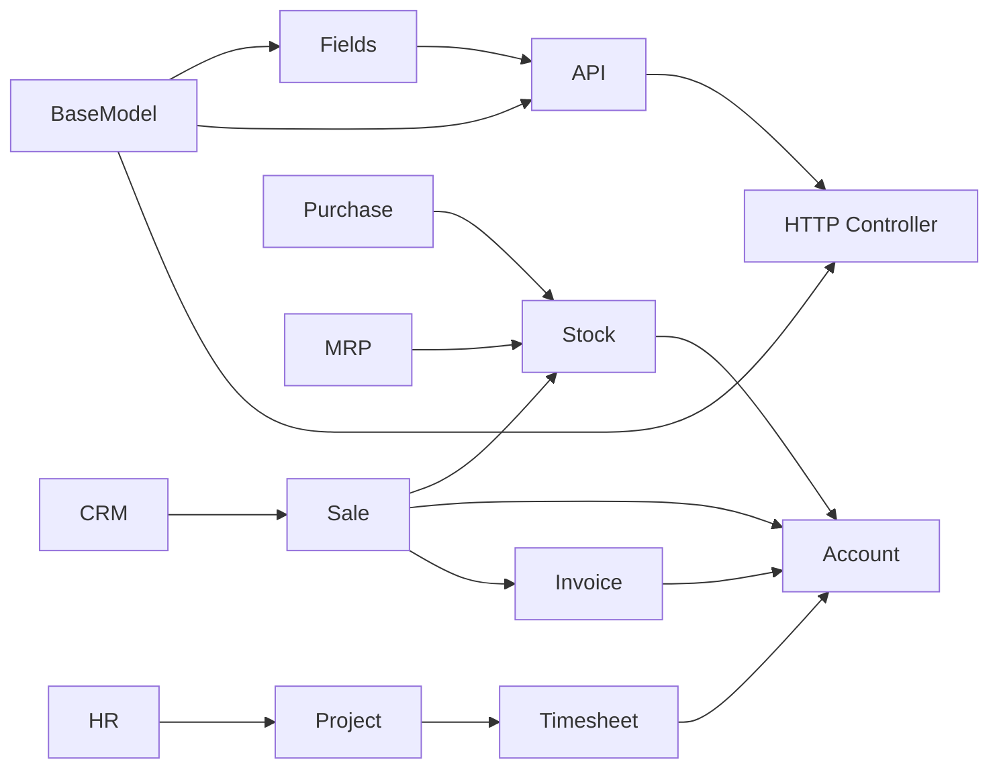

# Odoo 18 Knowledge Graph

## Overview

Knowledge graph untuk codebase **Odoo 18** — memetakan struktur, relasi, dan arsitektur modular. Vault ini menyediakan Level 1 (AI Reasoning) dan Level 2 (Developer + Business Consultant) documentation untuk semua module.

> **Location:** `/Users/tri-mac/odoo/odoo18/odoo/`
> **Total Modules:** 606 in addons (43 core + 563 extended)
> **Version:** 18.0 FINAL
> **Documentation Status:** In Progress — 37/606 documented (Phase 1-3 ✅, Phase 4 starting)

---

## Quick Navigation

### Core Framework
- [Core/BaseModel](odoo-18/Core/BaseModel.md) — ORM foundation
- [Core/Fields](odoo-18/Core/Fields.md) — Field types
- [Core/API](odoo-18/Core/API.md) — Decorators & method chains
- [Core/HTTP Controller](odoo-18/Core/HTTP Controller.md) — Web controllers
- [Core/Exceptions](odoo-18/Core/Exceptions.md) — Error handling

### Business Modules
- [Modules/Sale](odoo-18/Modules/sale.md) — Sales
- [Modules/Purchase](odoo-18/Modules/purchase.md) — Purchasing
- [Modules/Stock](odoo-18/Modules/stock.md) — Inventory
- [Modules/Account](odoo-18/Modules/account.md) — Accounting
- [Modules/CRM](odoo-18/Modules/CRM.md) — CRM
- [Modules/MRP](odoo-18/Modules/mrp.md) — Manufacturing
- [Modules/Product](odoo-18/Modules/product.md) — Products
- [Modules/HR](odoo-18/Modules/hr.md) — Human Resources
- [Modules/Project](odoo-18/Modules/project.md) — Project Management
- [Modules/POS](odoo-19/Modules/pos.md) — Point of Sale
- [Modules/Helpdesk](odoo-18/Modules/helpdesk.md) — Helpdesk
- [Modules/res.partner](odoo-19/Modules/res.partner.md) — Partners

---

## Patterns & Development
- [Patterns/Inheritance Patterns](odoo-18/Patterns/Inheritance Patterns.md) — _inherit vs _inherits vs mixin
- [Patterns/Workflow Patterns](odoo-18/Patterns/Workflow Patterns.md) — State machine + branching decision trees
- [Patterns/Security Patterns](odoo-18/Patterns/Security Patterns.md) — ACL CSV, ir.rule, field groups
- [Tools/Modules Inventory](odoo-18/Tools/Modules Inventory.md) — 304 modules catalog
- [Tools/ORM Operations](odoo-18/Tools/ORM Operations.md) — search(), browse(), create(), write(), domain operators
- [Snippets/Model Snippets](odoo-18/Snippets/Model Snippets.md) — Copy-paste code templates
- [Snippets/Controller Snippets](odoo-18/Snippets/Controller Snippets.md) — HTTP route handlers
- [Snippets/method-chain-example](odoo-18/Snippets/method-chain-example.md) — Method chain notation reference

---

## New in Odoo 18
- [New Features/What's New](odoo-18/New Features/What's New.md) — What's new in Odoo 18
- [New Features/API Changes](odoo-18/New Features/API Changes.md) — API changes from v17
- [New Features/New Modules](odoo-18/New Features/New Modules.md) — New modules in v18

---

## Documentation Progress

| Phase | Status | Tasks |
|-------|--------|-------|
| Phase 1 Foundation | ✅ Complete | 6/6 |
| Phase 2 Core Business | ✅ Complete | 12/12 |
| Phase 3 Extended Business | ✅ Complete | 15/15 |
| Phase 4 Website & POS | ✅ Complete | 18/18 |
| Phase 5 Integrations | ✅ Complete | 16/16 |
| Phase 6 Localization | Pending | 0/150+ |
| **TOTAL** | **64/606** | **10.5%** |

- [Documentation/Checkpoints/](Documentation/Checkpoints/.md) — Progress tracking
- [Research-Log/backlog](odoo-18/Research-Log/backlog.md) — Pending gaps

---

## Tags

#odoo #odoo18 #orm #web #modules
#ai-reasoning #method-chain #level1 #level2

---

## Graph Connections

