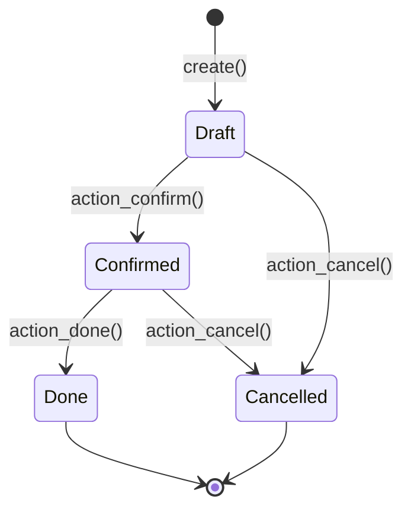

# {Flow Title}

> Level 1 AI-Optimized: Full method call sequences for {process}

## Flow Diagram



## Method Chain

```
model.create(vals)
  └─→ .action_confirm()
        └─→ ._action_confirm()
              └─→ .write({'state': 'sale'})
                    └─→ @api.depends('state') triggers
                          └─→ stock.picking.create()
                                └─→ @api.depends on sale.order
```

## States

| State | Description | Allowed Actions |
|-------|-------------|-----------------|
| `draft` | Initial state | confirm, cancel |
| `confirmed` | Approved | done, cancel |
| `done` | Completed | — |
| `cancel` | Cancelled | — |

## Key Fields

| Field | Type | Purpose |
|-------|------|---------|
| `name` | Char | Auto-generated sequence |
| `partner_id` | Many2one | Customer/Vendor |
| `date_order` | Date | Order date |
| `state` | Selection | Workflow state |

## Failure Modes

- **Duplicate detection**: Raises `UserError` if duplicate found
- **Access denied**: Raises `AccessError` if no write permission
- **Validation**: Raises `ValidationError` if constraints fail

## Related Links
- [Modules/{Module}](modules/{module}.md) — Model reference
- [Patterns/Workflow Patterns](patterns/workflow-patterns.md) — State machine patterns
