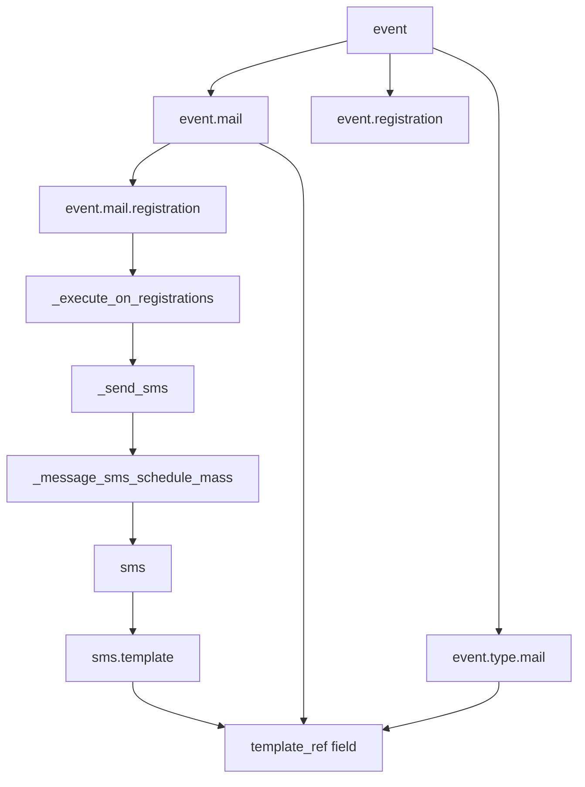

# event_sms — Event SMS Notifications

**Module:** `event_sms`
**Addon Path:** `odoo/addons/event_sms/`
**Depends:** `event`, `sms`
**Category:** Marketing/Events
**Auto-install:** Yes (with `event` + `sms`)
**License:** LGPL-3

Bridges the [Modules/Stock](modules/stock.md) event scheduling engine with the SMS gateway. Adds `sms` as a third `notification_type` alongside `mail` on `event.mail` and `event.type.mail`, enabling SMS reminders and post-registration confirmations for event attendees.

---

## Architecture

```
event (base)
  event.mail          — event.mail_scheduler_ids
  event.mail.registration — per-registration scheduler lines
  event.type.mail    — event type template schedulers
  event.registration  — attendees

event_sms (this module)
  event.mail         + notification_type='sms', template_ref→sms.template
  event.type.mail    + notification_type='sms', template_ref→sms.template
  event.mail.registration — _execute_on_registrations() sends SMS
  sms.template       + _search() filter, unlink cascade
```

---

## Models Extended

### `event.type.mail` — Event Type Mail Template (EXTENDED)

Inherits from `event.event.type.mail` (`event/models/event_mail.py`). Adds SMS as a selectable notification type.

#### Fields Added

| Field | Type | Description |
|-------|------|-------------|
| `notification_type` | Selection | Extended with `('sms', 'SMS')` option — computed based on `template_ref._name` |
| `template_ref` | Reference | Extended `selection_add=[('sms.template', 'SMS')]` alongside `mail.template` |

#### Methods

**`_compute_notification_type()`** — `api.depends('template_ref')`
- If `template_ref._name == 'sms.template'`, sets `notification_type = 'sms'`
- Falls back to parent (which sets `notification_type = 'mail'` for `mail.template`)
- This drives the UI label and which template model is used

#### Key Notes

- When a user picks `sms.template` in the template dropdown on an event-type mail configuration, the UI changes to show "SMS" instead of "Mail"
- Ondelete is `'cascade'` — deleting the SMS template removes the scheduler line
- Copied to `event.mail` records when an event is created from an event type

---

### `event.mail` — Event Mail Scheduler (EXTENDED)

Inherits from `event.event.mail` (`event/models/event_mail.py`). Core scheduler model that drives automated communications for an event.

#### Fields Added

| Field | Type | Description |
|-------|------|-------------|
| `notification_type` | Selection | Extended with `('sms', 'SMS')` option |
| `template_ref` | Reference | Extended `selection_add=[('sms.template', 'SMS')]` |

#### Methods

**`_compute_notification_type()`** — `api.depends('template_ref')`
- Mirrors `event.type.mail` behavior
- If `template_ref._name == 'sms.template'` → `notification_type = 'sms'`

**`_execute_event_based_for_registrations(registrations)`** — `api.multi`
- Called by `execute()` for `before_event` / `after_event` schedulers
- If `self.notification_type == "sms"` → calls `self._send_sms(registrations)`
- Otherwise falls through to `super()` for mail behavior

**`_send_sms(registrations)`** — `api.multi`
- Core SMS dispatch method
- Calls `registrations._message_sms_schedule_mass(template=self.template_ref, mass_keep_log=True)`
- `mass_keep_log=True` writes an internal note on each registration as an audit trail
- Template is the `sms.template` record referenced by `self.template_ref`

**`_template_model_by_notification_type()`** — `api.returns`
- Extends parent map: `info["sms"] = "sms.template"`
- Used by `_filter_template_ref()` to validate that a scheduler's `template_ref` points to the correct model for its `notification_type`

#### Key Scheduling Flow

```
execute()
  └─ _execute_event_based()          [before/after event]
        └─ _execute_event_based_for_registrations(registrations)
              └─ if notification_type == 'sms': _send_sms(registrations)
              └─ else: _send_mail(registrations)

execute()
  └─ _execute_attendee_based()       [after_sub — per registration]
        └─ event.mail.registration._execute_on_registrations()
              └─ event_sms: EventMailRegistration._execute_on_registrations()
                    └─ _send_sms(registration_ids)
```

---

### `event.mail.registration` — Registration Mail Scheduler (EXTENDED)

Inherits from `event.event.mail.registration` (`event/models/event_mail_registration.py`). A line record created per registration per scheduler for `interval_type='after_sub'` (post-registration triggers).

#### Methods Extended

**`_execute_on_registrations()`** — `api.multi`

```python
def _execute_on_registrations(self):
    todo = self.filtered(
        lambda r: r.scheduler_id.notification_type == "sms"
    )
    for scheduler, reg_mails in todo.grouped('scheduler_id').items():
        scheduler._send_sms(reg_mails.registration_id)
    todo.mail_sent = True

    return super(EventMailRegistration, self - todo)._execute_on_registrations()
```

Logic:
1. Filters schedulers where `notification_type == 'sms'`
2. Groups by `scheduler_id` to batch per-scheduler
3. Calls `scheduler_id._send_sms(registration_ids)` for SMS-type schedulers
4. Marks those registrations with `mail_sent = True`
5. Passes remaining (mail-type) registrations to the parent for email handling

#### Key Notes

- This override is the critical integration point: SMS and mail registrations are handled in the same pass
- `mail_sent` is shared between SMS and mail types — setting it here prevents duplicate SMS sends on re-runs
- The parent method only handles `notification_type == 'mail'` (via the `self - todo` filter)

---

### `sms.template` — SMS Template (EXTENDED)

Inherits from `sms.sms.template` (from the `sms` module).

#### Methods Added

**`_search(domain, *args, **kwargs)`** — `api.model` (overrides ORM `_search`)

```python
@api.model
def _search(self, domain, *args, **kwargs):
    if self.env.context.get('filter_template_on_event'):
        domain = expression.AND([[('model', '=', 'event.registration')], domain])
    return super()._search(domain, *args, **kwargs)
```

Purpose: The `template_ref` field is a `Reference` field (polymorphic) that stores `<model_name>,<id>`. Reference fields do not support `domain` in their field definition. This hack injects `model = 'event.registration'` into searches when the context key `filter_template_on_event` is set (by the JS widget in `static/src/template_reference_field/`). Without this, the template selector in the event mail UI would show all SMS templates for all models.

**`unlink()`** — `api.override`

```python
def unlink(self):
    res = super().unlink()
    domain = ('template_ref', 'in', [f"{template._name},{template.id}" for template in self])
    self.env['event.mail'].sudo().search([domain]).unlink()
    self.env['event.type.mail'].sudo().search([domain]).unlink()
    return res
```

Purpose: When an SMS template is deleted, cascades the deletion to all `event.mail` and `event.type.mail` records that reference it. The `ondelete='cascade'` on the `template_ref` field already handles the reference pointer; this explicit cleanup catches scheduler records where the template was referenced.

---

## Default SMS Templates (from `data/sms_data.xml`)

Two pre-installed `sms.template` records are created with `noupdate="1"`:

### `sms_template_data_event_registration` — "Event: Registration"
- Model: `event.registration`
- Body:
  ```
  {{ object.event_id.organizer_id.name or object.event_id.company_id.name or user.env.company.name }}:
  We are happy to confirm your registration for the {{ object.event_id.name }} event.
  ```
- Lang: `{{ object.partner_id.lang }}`

### `sms_template_data_event_reminder` — "Event: Reminder"
- Model: `event.registration`
- Body: Dynamic reminder including event name, date/time (formatted in partner's timezone), venue address, and event URL
- Lang: `{{ object.partner_id.lang }}`

---

## L4: How Event SMS Scheduling Works

### The Dual-Notification Architecture

`event.mail` schedulers support three `interval_type` values:

| `interval_type` | Description | How SMS is sent |
|----------------|-------------|-----------------|
| `after_sub` | Immediately/some time after registration | `event.mail.registration._execute_on_registrations()` filters by `notification_type='sms'`, calls `scheduler._send_sms()` |
| `before_event` | X hours/days before event | `execute()` calls `_execute_event_based()` → `_execute_event_based_for_registrations()` → `_send_sms()` |
| `after_event` | X hours/days after event ends | Same as `before_event` |

### The Cron Driver

The cron `ir_cron_mail_scheduler_action` calls `event.mail.schedule_communications()` which:
1. Searches for `event.mail` records where `scheduled_date <= now`, `mail_done = False`, and event is not finished
2. Calls `execute()` on each scheduler in batch
3. `execute()` dispatches to either `_execute_attendee_based()` (for `after_sub`) or `_execute_event_based()` (for `before_event`/`after_event`)

### SMS Send Mechanism

`sale_order_line._send_sms()` delegates to:

```python
def _send_sms(self, registrations):
    registrations._message_sms_schedule_mass(
        template=self.template_ref,
        mass_keep_log=True
    )
```

`registrations._message_sms_schedule_mass()` is provided by the `sms` module's mixin on `event.registration`. It:
1. Renders the SMS body using the template with the registration as the record context
2. Sends the SMS via the SMS gateway (IAP or SMS aggregator)
3. Creates an `sms.sms` record with `state='sent'` for audit trail
4. Posts an internal note on the registration (because `mass_keep_log=True`)

### Security Context

- `_send_sms()` is called from cron as `SUPERUSER_ID` via `event.mail.run()`
- The `event.mail.registration` records are created by `super()` so standard access rules apply
- The `mail_sent = True` flag prevents double-sending on cron re-runs

---

## Dependencies



---

## See Also

- [Core/API](core/api.md) — @api.depends, @api.onchange decorators
- [Modules/Stock](modules/stock.md) — event.sms notification context
- `event_sale` — event ticket sales that create registrations (which then receive SMS notifications)
