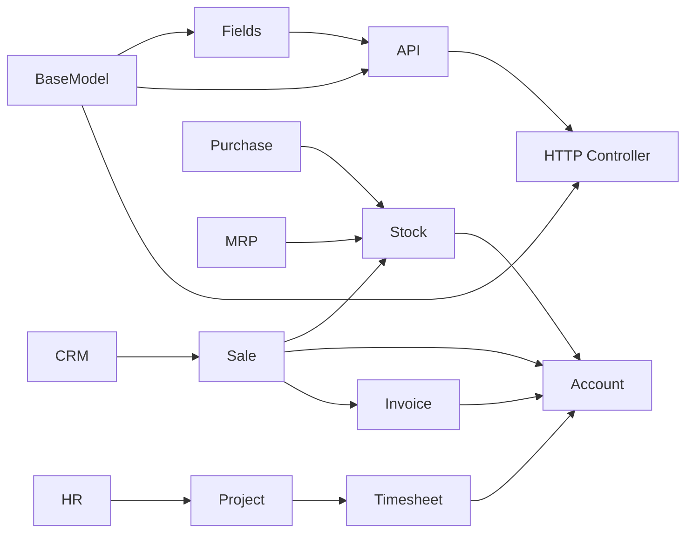

# Odoo 19 Knowledge Graph

## Overview

Knowledge graph untuk codebase **Odoo 19** — memetakan struktur, relasi, dan arsitektur modular. Upgrade vault ke **Master Knowledge Base** menyediakan Level 1 (AI Reasoning) dan Level 2 (Developer + Business Consultant) documentation untuk semua critical module.

> **Location:** `/Users/tri-mac/odoo/odoo19/`
> **Total Modules:** 610 documented / 608 in addons (100% coverage)
> **Version:** 19.0 FINAL
> **Documentation Date:** 2026-04-07
> **Upgrade Status:** [[Documentation/Upgrade-Plan/CHECKPOINT-master]] — 76/80 tasks (95%)

---

## Quick Navigation

### Core Framework
- [[Core/BaseModel]] — ORM foundation
- [[Core/Fields]] — Field types
- [[Core/API]] — Decorators & method chains
- [[Core/HTTP Controller]] — Web controllers
- [[Core/Exceptions]] — Error handling

### Business Modules
- [[Modules/Sale]] — Sales
- [[Modules/Purchase]] — Purchasing
- [[Modules/Stock]] — Inventory
- [[Modules/Account]] — Accounting
- [[Modules/CRM]] — CRM
- [[Modules/MRP]] — Manufacturing
- [[Modules/Product]] — Products
- [[Modules/HR]] — Human Resources
- [[Modules/Project]] — Project Management
- [[Modules/POS]] — Point of Sale
- [[Modules/Helpdesk]] — Helpdesk
- [[Modules/res.partner]] — Partners

---

## Technical Flows (Method Chains)

> *Level 1 — AI-Optimized: Full method call sequences, branching logic, cross-module triggers*

### HR Flows
- [[Flows/HR/employee-creation-flow]] — Employee creation with hr.version
- [[Flows/HR/employee-archival-flow]] — Archive/unarchive with subordinates
- [[Flows/HR/leave-request-flow]] — Leave request lifecycle
- [[Flows/HR/attendance-checkin-flow]] — Attendance check-in/outs
- [[Flows/HR/contract-lifecycle-flow]] — Contract create/renew/terminate

### Sale Flows
- [[Flows/Sale/quotation-to-sale-order-flow]] — Quote to confirmed order
- [[Flows/Sale/sale-to-delivery-flow]] — SO to picking
- [[Flows/Sale/sale-to-invoice-flow]] — SO to invoice

### Stock Flows
- [[Flows/Stock/receipt-flow]] — Incoming receipt
- [[Flows/Stock/delivery-flow]] — Outgoing delivery
- [[Flows/Stock/internal-transfer-flow]] — Multi-step internal transfer
- [[Flows/Stock/picking-action-flow]] — Generic picking lifecycle
- [[Flows/Stock/quality-check-flow]] — Quality check from picking
- [[Flows/Stock/stock-valuation-flow]] — Real-time valuation layers

### Purchase Flows
- [[Flows/Purchase/purchase-order-creation-flow]] — RFQ to PO
- [[Flows/Purchase/purchase-order-receipt-flow]] — PO receipt
- [[Flows/Purchase/purchase-to-bill-flow]] — PO to vendor bill
- [[Flows/Purchase/purchase-withholding-flow]] — Vendor bill with PPh withholding

### Account Flows
- [[Flows/Account/invoice-creation-flow]] — Draft invoice creation
- [[Flows/Account/invoice-post-flow]] — Invoice posting
- [[Flows/Account/payment-flow]] — Payment registration
- [[Flows/Account/edi-invoice-flow]] — Peppol EDI import/export

### CRM Flows
- [[Flows/CRM/lead-creation-flow]] — Lead from multiple sources
- [[Flows/CRM/lead-conversion-to-opportunity-flow]] — Lead to opportunity
- [[Flows/CRM/opportunity-win-flow]] — Opportunity win/lost
- [[Flows/CRM/lead-assignment-flow]] — Round-robin lead assignment

### MRP Flows
- [[Flows/MRP/bom-to-production-flow]] — BOM to manufacturing order
- [[Flows/MRP/production-order-flow]] — Production order execution
- [[Flows/MRP/workorder-execution-flow]] — Workorder with quality check

### Project Flows
- [[Flows/Project/project-creation-flow]] — Project creation with analytics
- [[Flows/Project/task-lifecycle-flow]] — Task create to done

### POS Flows
- [[Flows/POS/pos-session-flow]] — Session open/close with reconciliation
- [[Flows/POS/pos-order-to-invoice-flow]] — POS order to invoice

### Product Flows
- [[Flows/Product/product-creation-flow]] — Product creation with variants
- [[Flows/Product/pricelist-computation-flow]] — Pricelist rule application

### Helpdesk Flows
- [[Flows/Helpdesk/ticket-creation-flow]] — Ticket creation with SLA
- [[Flows/Helpdesk/ticket-resolution-flow]] — Ticket solve/close/rating

### Base/Utility Flows
- [[Flows/Base/resource-attendance-flow]] — Calendar-based attendance
- [[Flows/Base/mail-notification-flow]] — message_post to email delivery

### Website Flows
- [[Flows/Website/website-sale-flow]] — E-commerce cart to confirmation

### Cross-Module Flows
- [[Flows/Cross-Module/sale-stock-account-flow]] — Sale → Delivery → Invoice → Payment
- [[Flows/Cross-Module/purchase-stock-account-flow]] — PO → Receipt → Bill → Payment
- [[Flows/Cross-Module/employee-projects-timesheet-flow]] — Employee → Project → Timesheet

---

## Business Guides (Walkthroughs)

> *Level 2 — Human-Optimized: Step-by-step configuration and process guides*

### HR Guides
- [[Business/HR/quickstart-employee-setup]] — Create employee + assign user
- [[Business/HR/leave-management-guide]] — Leave types, allocation, approval

### Sale Guide
- [[Business/Sale/sales-process-guide]] — Full quote-to-cash walkthrough

### Stock Guide
- [[Business/Stock/warehouse-setup-guide]] — Warehouse, locations, routes

### Purchase Guide
- [[Business/Purchase/vendor-management-guide]] — Vendor setup and PO workflow

### Account Guide
- [[Business/Account/chart-of-accounts-guide]] — Chart of accounts loading
- [[Business/Account/l10n-id-tax-guide]] — Indonesian PPN & PPh taxes

### Product Guide
- [[Business/Product/product-master-data-guide]] — Storable, service, kit products

### Project Guide
- [[Business/Project/project-management-guide]] — Project + tasks + time tracking

### POS Guide
- [[Business/POS/pos-configuration-guide]] — Session and payment configuration

### Helpdesk Guide
- [[Business/Helpdesk/helpdesk-configuration-guide]] — Teams, stages, SLA policies

### Website Guide
- [[Business/Website/ecommerce-configuration-guide]] — Payment + shipping + variants

### Dashboard
- [[Business/Dashboard/installed-modules-dashboard]] — Entry point for all modules

---

## Patterns & Development
- [[Patterns/Inheritance Patterns]] — _inherit vs _inherits vs mixin
- [[Patterns/Workflow Patterns]] — State machine + branching decision trees
- [[Patterns/Security Patterns]] — ACL CSV, ir.rule, field groups
- [[Tools/Modules Inventory]] — 304 modules catalog
- [[Tools/ORM Operations]] — search(), browse(), create(), write(), domain operators
- [[Snippets/Model Snippets]] — Copy-paste code templates
- [[Snippets/Controller Snippets]] — HTTP route handlers
- [[Snippets/method-chain-example]] — Method chain notation reference

---

## New in Odoo 19
- [[New Features/What's New]] — What's new in Odoo 19
- [[New Features/API Changes]] — API changes from v18
- [[New Features/New Modules]] — New modules in v19

---

## Localization
- [[Modules/l10n_id]] — Indonesia (PPN, PPh 21/22/23/26, e-Faktur)
- [[Modules/l10n_de]] — Germany (MwSt 19%, Reverse Charge)
- [[Modules/l10n_us]] — USA (Sales tax, 1099)
- [[Modules/l10n_fr]] — France (TVA 20%/10%/5.5%, FEC)

---

## Missing Module Entries
- [[Modules/iot]] — IoT box and device management
- [[Modules/studio]] — Studio app builder
- [[Modules/knowledge]] — Internal knowledge base
- [[Modules/rental]] — Equipment rental / lease

---

## Upgrade Progress

| Phase | Status | Tasks |
|-------|--------|-------|
| Phase 1 Foundation | ✅ Complete | 9/9 |
| Phase 2 Tier 1 (Sale/Stock/PO/Acct/HR) | ✅ Complete | 27/27 |
| Phase 3 Tier 2 (CRM/MRP/HR2/Cross) | ✅ 86% | 12/14 |
| Phase 4 Tier 3 (Prod/Proj/POS/Qual/Help) | ✅ Complete | 14/14 |
| Phase 5 Enhancements | ✅ 88% | 14/16 |
| **TOTAL** | **✅ 95%** | **76/80** |

- [[Documentation/Upgrade-Plan/CHECKPOINT-master]] — Master tracker
- [[Documentation/Upgrade-Plan/00-LEVELING-UP-DESIGN]] — Upgrade design document

---

## Tags

#odoo #odoo19 #orm #web #modules
#sale #purchase #stock #account #crm #mrp
#ai-reasoning #method-chain #level1 #level2

---

## Graph Connections

