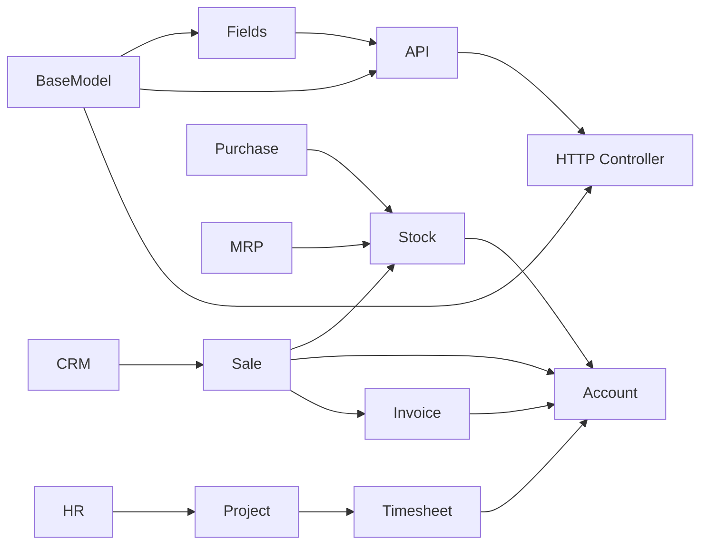

# Odoo 19 Knowledge Graph

## Overview

Knowledge graph untuk codebase **Odoo 19** — memetakan struktur, relasi, dan arsitektur modular. Upgrade vault ke **Master Knowledge Base** menyediakan Level 1 (AI Reasoning) dan Level 2 (Developer + Business Consultant) documentation untuk semua critical module.

> **Location:** `/Users/tri-mac/odoo/odoo19/`
> **Total Modules:** 610 documented / 608 in addons (100% coverage)
> **Version:** 19.0 FINAL
> **Documentation Date:** 2026-04-07
> **Upgrade Status:** [Documentation/Upgrade-Plan/CHECKPOINT-master](Documentation/Upgrade-Plan/CHECKPOINT-master.md) — 76/80 tasks (95%)

---

## Quick Navigation

### Core Framework
- [Core/BaseModel](Core/BaseModel.md) — ORM foundation
- [Core/Fields](Core/Fields.md) — Field types
- [Core/API](Core/API.md) — Decorators & method chains
- [Core/HTTP Controller](odoo-18/Core/HTTP Controller.md) — Web controllers
- [Core/Exceptions](Core/Exceptions.md) — Error handling

### Business Modules
- [Modules/Sale](Modules/sale.md) — Sales
- [Modules/Purchase](Modules/purchase.md) — Purchasing
- [Modules/Stock](Modules/stock.md) — Inventory
- [Modules/Account](Modules/account.md) — Accounting
- [Modules/CRM](Modules/CRM.md) — CRM
- [Modules/MRP](Modules/mrp.md) — Manufacturing
- [Modules/Product](Modules/product.md) — Products
- [Modules/HR](Modules/hr.md) — Human Resources
- [Modules/Project](Modules/project.md) — Project Management
- [Modules/POS](Modules/pos.md) — Point of Sale
- [Modules/Helpdesk](Modules/helpdesk.md) — Helpdesk
- [Modules/res.partner](Modules/res.partner.md) — Partners

---

## Technical Flows (Method Chains)

> *Level 1 — AI-Optimized: Full method call sequences, branching logic, cross-module triggers*

### HR Flows
- [Flows/HR/employee-creation-flow](Flows/HR/employee-creation-flow.md) — Employee creation with hr.version
- [Flows/HR/employee-archival-flow](Flows/HR/employee-archival-flow.md) — Archive/unarchive with subordinates
- [Flows/HR/leave-request-flow](Flows/HR/leave-request-flow.md) — Leave request lifecycle
- [Flows/HR/attendance-checkin-flow](Flows/HR/attendance-checkin-flow.md) — Attendance check-in/outs
- [Flows/HR/contract-lifecycle-flow](Flows/HR/contract-lifecycle-flow.md) — Contract create/renew/terminate

### Sale Flows
- [Flows/Sale/quotation-to-sale-order-flow](Flows/Sale/quotation-to-sale-order-flow.md) — Quote to confirmed order
- [Flows/Sale/sale-to-delivery-flow](Flows/Sale/sale-to-delivery-flow.md) — SO to picking
- [Flows/Sale/sale-to-invoice-flow](Flows/Sale/sale-to-invoice-flow.md) — SO to invoice

### Stock Flows
- [Flows/Stock/receipt-flow](Flows/Stock/receipt-flow.md) — Incoming receipt
- [Flows/Stock/delivery-flow](Flows/Stock/delivery-flow.md) — Outgoing delivery
- [Flows/Stock/internal-transfer-flow](Flows/Stock/internal-transfer-flow.md) — Multi-step internal transfer
- [Flows/Stock/picking-action-flow](Flows/Stock/picking-action-flow.md) — Generic picking lifecycle
- [Flows/Stock/quality-check-flow](Flows/Stock/quality-check-flow.md) — Quality check from picking
- [Flows/Stock/stock-valuation-flow](Flows/Stock/stock-valuation-flow.md) — Real-time valuation layers

### Purchase Flows
- [Flows/Purchase/purchase-order-creation-flow](Flows/Purchase/purchase-order-creation-flow.md) — RFQ to PO
- [Flows/Purchase/purchase-order-receipt-flow](Flows/Purchase/purchase-order-receipt-flow.md) — PO receipt
- [Flows/Purchase/purchase-to-bill-flow](Flows/Purchase/purchase-to-bill-flow.md) — PO to vendor bill
- [Flows/Purchase/purchase-withholding-flow](Flows/Purchase/purchase-withholding-flow.md) — Vendor bill with PPh withholding

### Account Flows
- [Flows/Account/invoice-creation-flow](Flows/Account/invoice-creation-flow.md) — Draft invoice creation
- [Flows/Account/invoice-post-flow](Flows/Account/invoice-post-flow.md) — Invoice posting
- [Flows/Account/payment-flow](Flows/Account/payment-flow.md) — Payment registration
- [Flows/Account/edi-invoice-flow](Flows/Account/edi-invoice-flow.md) — Peppol EDI import/export

### CRM Flows
- [Flows/CRM/lead-creation-flow](Flows/CRM/lead-creation-flow.md) — Lead from multiple sources
- [Flows/CRM/lead-conversion-to-opportunity-flow](Flows/CRM/lead-conversion-to-opportunity-flow.md) — Lead to opportunity
- [Flows/CRM/opportunity-win-flow](Flows/CRM/opportunity-win-flow.md) — Opportunity win/lost
- [Flows/CRM/lead-assignment-flow](Flows/CRM/lead-assignment-flow.md) — Round-robin lead assignment

### MRP Flows
- [Flows/MRP/bom-to-production-flow](Flows/MRP/bom-to-production-flow.md) — BOM to manufacturing order
- [Flows/MRP/production-order-flow](Flows/MRP/production-order-flow.md) — Production order execution
- [Flows/MRP/workorder-execution-flow](Flows/MRP/workorder-execution-flow.md) — Workorder with quality check

### Project Flows
- [Flows/Project/project-creation-flow](Flows/Project/project-creation-flow.md) — Project creation with analytics
- [Flows/Project/task-lifecycle-flow](Flows/Project/task-lifecycle-flow.md) — Task create to done

### POS Flows
- [Flows/POS/pos-session-flow](Flows/POS/pos-session-flow.md) — Session open/close with reconciliation
- [Flows/POS/pos-order-to-invoice-flow](Flows/POS/pos-order-to-invoice-flow.md) — POS order to invoice

### Product Flows
- [Flows/Product/product-creation-flow](Flows/Product/product-creation-flow.md) — Product creation with variants
- [Flows/Product/pricelist-computation-flow](Flows/Product/pricelist-computation-flow.md) — Pricelist rule application

### Helpdesk Flows
- [Flows/Helpdesk/ticket-creation-flow](Flows/Helpdesk/ticket-creation-flow.md) — Ticket creation with SLA
- [Flows/Helpdesk/ticket-resolution-flow](Flows/Helpdesk/ticket-resolution-flow.md) — Ticket solve/close/rating

### Base/Utility Flows
- [Flows/Base/resource-attendance-flow](Flows/Base/resource-attendance-flow.md) — Calendar-based attendance
- [Flows/Base/mail-notification-flow](Flows/Base/mail-notification-flow.md) — message_post to email delivery

### Website Flows
- [Flows/Website/website-sale-flow](Flows/Website/website-sale-flow.md) — E-commerce cart to confirmation

### Cross-Module Flows
- [Flows/Cross-Module/sale-stock-account-flow](Flows/Cross-Module/sale-stock-account-flow.md) — Sale → Delivery → Invoice → Payment
- [Flows/Cross-Module/purchase-stock-account-flow](Flows/Cross-Module/purchase-stock-account-flow.md) — PO → Receipt → Bill → Payment
- [Flows/Cross-Module/employee-projects-timesheet-flow](Flows/Cross-Module/employee-projects-timesheet-flow.md) — Employee → Project → Timesheet

---

## Business Guides (Walkthroughs)

> *Level 2 — Human-Optimized: Step-by-step configuration and process guides*

### HR Guides
- [Business/HR/quickstart-employee-setup](Business/HR/quickstart-employee-setup.md) — Create employee + assign user
- [Business/HR/leave-management-guide](Business/HR/leave-management-guide.md) — Leave types, allocation, approval

### Sale Guide
- [Business/Sale/sales-process-guide](Business/Sale/sales-process-guide.md) — Full quote-to-cash walkthrough

### Stock Guide
- [Business/Stock/warehouse-setup-guide](Business/Stock/warehouse-setup-guide.md) — Warehouse, locations, routes

### Purchase Guide
- [Business/Purchase/vendor-management-guide](Business/Purchase/vendor-management-guide.md) — Vendor setup and PO workflow

### Account Guide
- [Business/Account/chart-of-accounts-guide](Business/Account/chart-of-accounts-guide.md) — Chart of accounts loading
- [Business/Account/l10n-id-tax-guide](Business/Account/l10n-id-tax-guide.md) — Indonesian PPN & PPh taxes

### Product Guide
- [Business/Product/product-master-data-guide](Business/Product/product-master-data-guide.md) — Storable, service, kit products

### Project Guide
- [Business/Project/project-management-guide](Business/Project/project-management-guide.md) — Project + tasks + time tracking

### POS Guide
- [Business/POS/pos-configuration-guide](Business/POS/pos-configuration-guide.md) — Session and payment configuration

### Helpdesk Guide
- [Business/Helpdesk/helpdesk-configuration-guide](Business/Helpdesk/helpdesk-configuration-guide.md) — Teams, stages, SLA policies

### Website Guide
- [Business/Website/ecommerce-configuration-guide](Business/Website/ecommerce-configuration-guide.md) — Payment + shipping + variants

### Dashboard
- [Business/Dashboard/installed-modules-dashboard](Business/Dashboard/installed-modules-dashboard.md) — Entry point for all modules

---

## Patterns & Development
- [Patterns/Inheritance Patterns](odoo-18/Patterns/Inheritance Patterns.md) — _inherit vs _inherits vs mixin
- [Patterns/Workflow Patterns](odoo-18/Patterns/Workflow Patterns.md) — State machine + branching decision trees
- [Patterns/Security Patterns](odoo-18/Patterns/Security Patterns.md) — ACL CSV, ir.rule, field groups
- [Tools/Modules Inventory](odoo-18/Tools/Modules Inventory.md) — 304 modules catalog
- [Tools/ORM Operations](odoo-18/Tools/ORM Operations.md) — search(), browse(), create(), write(), domain operators
- [Snippets/Model Snippets](odoo-18/Snippets/Model Snippets.md) — Copy-paste code templates
- [Snippets/Controller Snippets](odoo-18/Snippets/Controller Snippets.md) — HTTP route handlers
- [Snippets/method-chain-example](Snippets/method-chain-example.md) — Method chain notation reference

---

## New in Odoo 19
- [New Features/What's New](odoo-18/New Features/What's New.md) — What's new in Odoo 19
- [New Features/API Changes](odoo-18/New Features/API Changes.md) — API changes from v18
- [New Features/New Modules](odoo-18/New Features/New Modules.md) — New modules in v19

---

## Localization
- [Modules/l10n_id](Modules/l10n_id.md) — Indonesia (PPN, PPh 21/22/23/26, e-Faktur)
- [Modules/l10n_de](Modules/l10n_de.md) — Germany (MwSt 19%, Reverse Charge)
- [Modules/l10n_us](Modules/l10n_us.md) — USA (Sales tax, 1099)
- [Modules/l10n_fr](Modules/l10n_fr.md) — France (TVA 20%/10%/5.5%, FEC)

---

## Missing Module Entries
- [Modules/iot](Modules/iot.md) — IoT box and device management
- [Modules/studio](Modules/studio.md) — Studio app builder
- [Modules/knowledge](Modules/knowledge.md) — Internal knowledge base
- [Modules/rental](Modules/rental.md) — Equipment rental / lease

---

## Upgrade Progress

| Phase | Status | Tasks |
|-------|--------|-------|
| Phase 1 Foundation | ✅ Complete | 9/9 |
| Phase 2 Tier 1 (Sale/Stock/PO/Acct/HR) | ✅ Complete | 27/27 |
| Phase 3 Tier 2 (CRM/MRP/HR2/Cross) | ✅ 86% | 12/14 |
| Phase 4 Tier 3 (Prod/Proj/POS/Qual/Help) | ✅ Complete | 14/14 |
| Phase 5 Enhancements | ✅ 88% | 14/16 |
| **TOTAL** | **✅ 95%** | **76/80** |

- [Documentation/Upgrade-Plan/CHECKPOINT-master](Documentation/Upgrade-Plan/CHECKPOINT-master.md) — Master tracker
- [Documentation/Upgrade-Plan/00-LEVELING-UP-DESIGN](Documentation/Upgrade-Plan/00-LEVELING-UP-DESIGN.md) — Upgrade design document

---

## Tags

#odoo #odoo19 #orm #web #modules
#sale #purchase #stock #account #crm #mrp
#ai-reasoning #method-chain #level1 #level2

---

## Graph Connections

