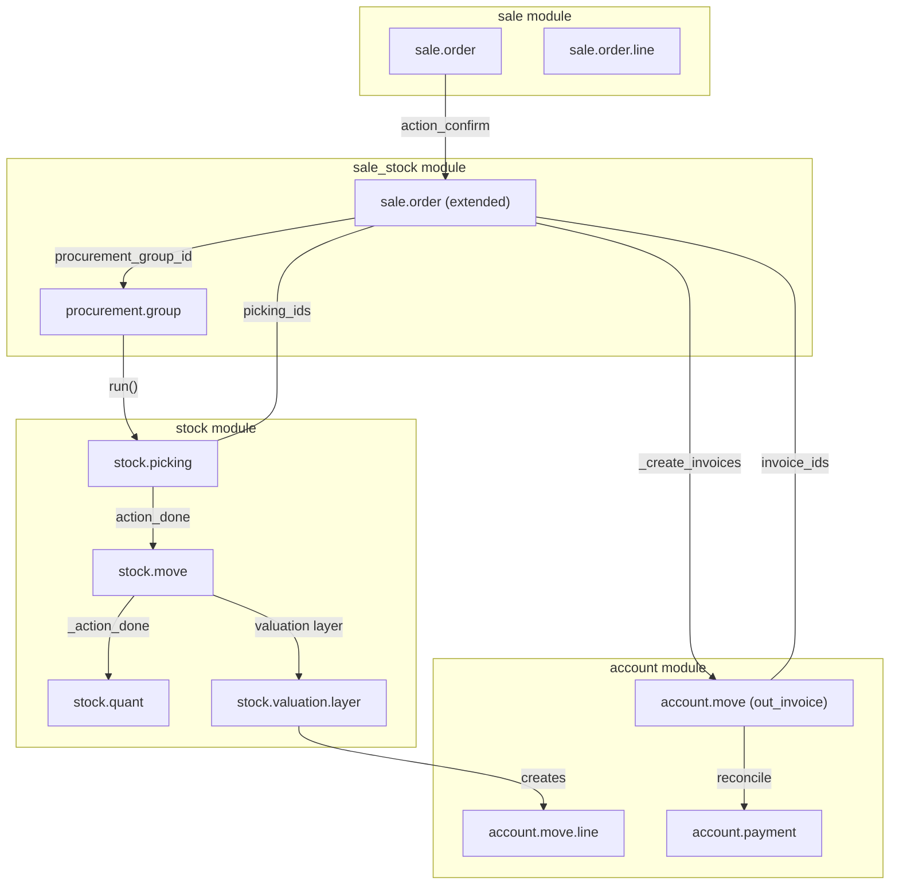
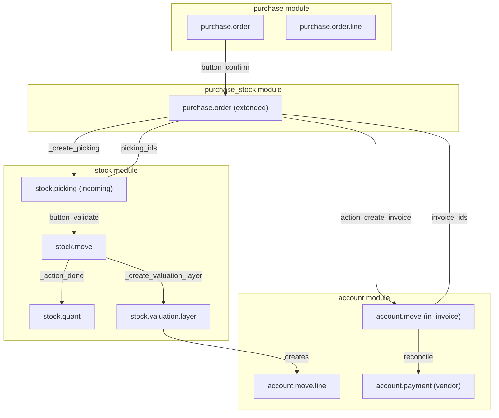
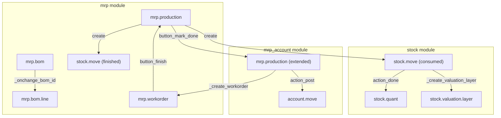
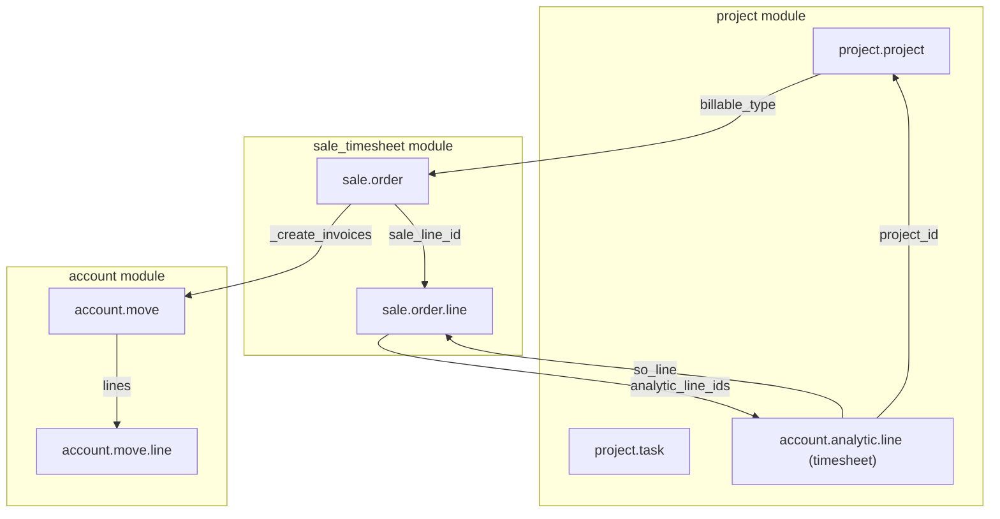
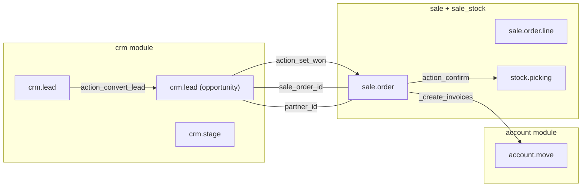
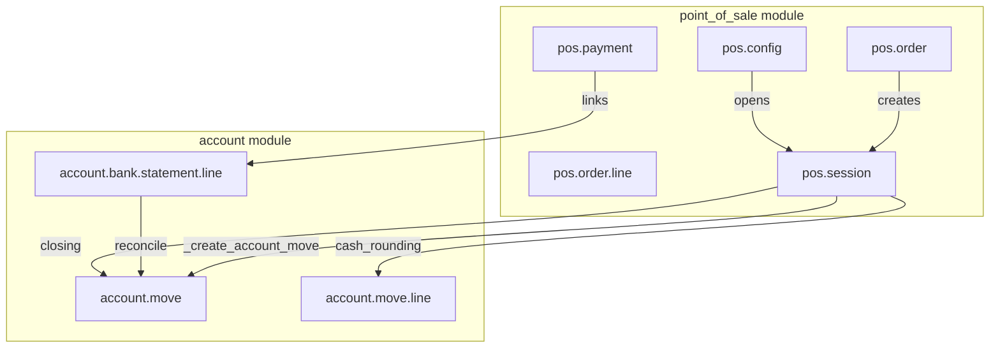
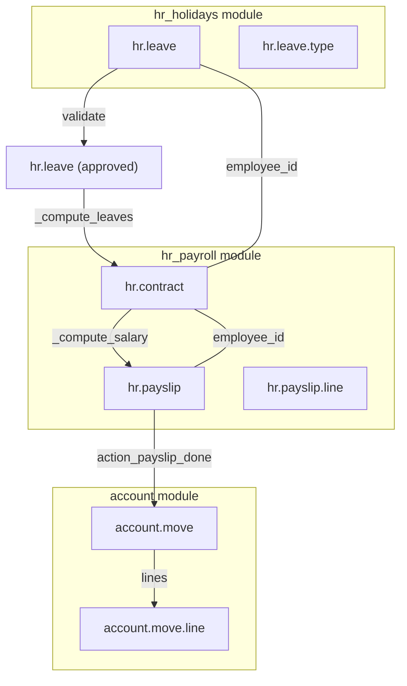
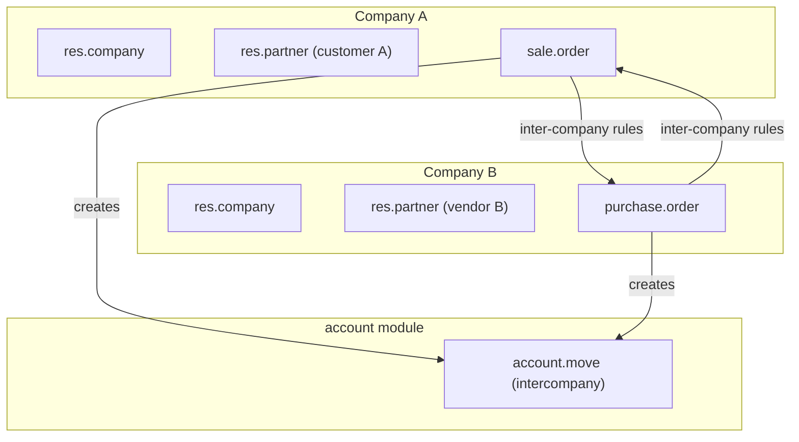
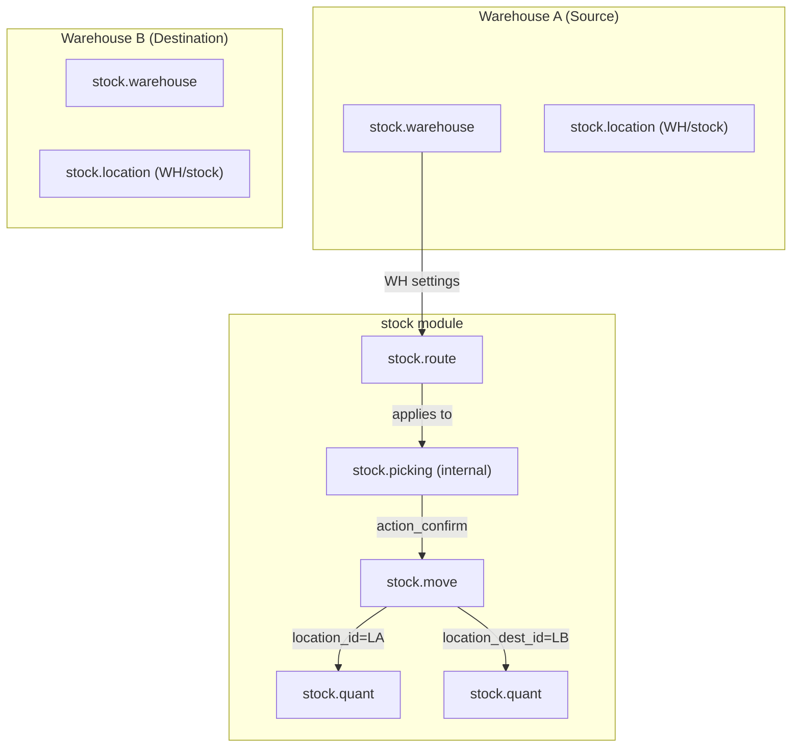
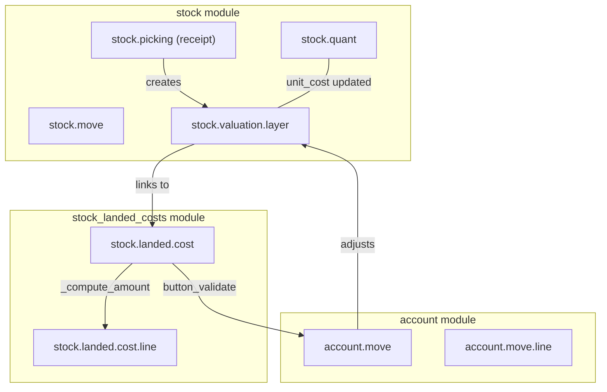

# Cross-Module Integration Patterns

## Overview

Cross-module integration in [Odoo 19](../Modules/Account.md) is the backbone of its ERP philosophy: every business transaction flows seamlessly across modules, automatically creating accounting entries, stock movements, and procurement operations without manual intervention. Unlike siloed applications, Odoo's integrated architecture ensures that a confirmed [sale order](../Modules/Sale.md) automatically triggers [stock delivery](../Modules/Stock.md), which automatically posts [cost of goods sold](../Modules/Account.md) entries, which reconciles with customer invoices. This document maps every major cross-module flow, explaining the models involved, state transitions, account entries generated, onchange and computed fields in the chain, and common errors with debugging strategies.

The flows documented here use Odoo 19 Community Edition source paths at `~/odoo/odoo19/odoo/addons/`. All flows are traceable to their actual Python method implementations in the Odoo CE codebase.

---

## 1. Sale to Delivery to Invoice (`sale_stock` + `account`)

### 1.1 Flow Overview



### 1.2 Models and Relationships

| Model | Module | Role | Key Fields |
|-------|--------|------|------------|
| `sale.order` | `sale` | Sales order header | `partner_id`, `state`, `warehouse_id`, `picking_policy`, `order_policy` |
| `sale.order.line` | `sale` | Order lines | `product_id`, `product_uom_qty`, `price_unit`, `qty_delivered`, `qty_invoiced` |
| `sale.order` (extended) | `sale_stock` | Adds stock linkage | `picking_ids`, `delivery_count`, `delivery_status`, `effective_date` |
| `procurement.group` | `stock` | Groups procurement | `name` (linked to SO name), `partner_id` |
| `stock.picking` | `stock` | Delivery order | `sale_id`, `partner_id`, `picking_type_id`, `state` |
| `stock.move` | `stock` | Stock movement | `sale_line_id`, `product_id`, `product_uom_qty`, `quantity_done` |
| `stock.quant` | `stock` | Inventory quantities | `product_id`, `location_id`, `quantity`, `reserved_quantity` |
| `stock.valuation.layer` | `stock_account` | Valuation tracking | `stock_move_id`, `quantity`, `unit_cost`, `value` |
| `account.move` | `account` | Customer invoice | `partner_id`, `move_type='out_invoice'`, `invoice_origin`, `state` |
| `account.payment` | `account` | Customer payment | `partner_id`, `amount`, `journal_id`, `state`, `reconciled_line_ids` |

### 1.3 State Transitions

**Sale Order States** (from `sale/models/sale_order.py`, line 26-31):
```python
SALE_ORDER_STATE = [
    ('draft', "Quotation"),
    ('sent', "Quotation Sent"),
    ('sale', "Sales Order"),
    ('cancel', "Cancelled"),
]
```

**Stock Picking States** (from `stock/models/stock_move.py`):
```python
# Incoming / Outgoing transfer states:
'draft' → 'confirmed' → 'assigned' → 'done'
                ↓
           'partially_available'
# Any state → 'cancel'
```

**Invoice States**:
```python
'draft' → 'posted' → 'in_payment' → 'paid'
                    ↓
              'cancelled'
```

### 1.4 Complete Method Chain: SO Confirmation

Located in `sale/models/sale_order.py` and `sale_stock/models/sale_order.py`:

```
sale.order.action_confirm()           [line 1157]
  │
  ├─► _confirmation_error_message()  [line 1194]
  │      └─► Validates: state is draft/sent, all lines have product_id
  │
  ├─► order_line._validate_analytic_distribution()
  │
  ├─► write({'state': 'sale', 'date_order': now()})  [line 1173]
  │
  ├─► _action_confirm()              [sale/models/sale_order.py:1222]
  │      └─► HOOK — extended by sale_stock
  │
  └─► sale_stock._action_confirm()  [sale_stock/models/sale_order.py]
         ├─► procurement_group_id = group.create({...})   [sale_stock]
         │      └─► group.name = so.name (links SO to picking)
         │
         ├─► for each sol: sol._action_launch_stock_rule()
         │      └─► procurement.group.run(pull=True)
         │             └─► stock.rule._run_pull()
         │                    └─► stock.picking.create()
         │                           ├─► picking_type_id = warehouse.out_type_id
         │                           ├─► sale_id = self (link back)
         │                           └─► group_id = procurement_group
         │
         ├─► stock.move.create() — one per SOL
         │      ├─► product_id = sol.product_id
         │      ├─► product_uom_qty = sol.product_uom_qty
         │      ├─► location_id = WH stock
         │      ├─► location_dest_id = Customer location
         │      ├─► sale_line_id = sol
         │      └─► state = 'draft' or 'confirmed'
         │
         ├─► so.picking_ids updated (one2many)
         │
         └─► message_post + activity_schedule
```

### 1.5 Delivery Validation: Stock Move Done

Located in `stock/models/stock_picking.py` (line 1256-1281):

```
stock.picking.button_validate()     [line 1397]
  └─► _action_done()               [line 1256]
         ├─► todo_moves = move_ids.filtered(state in [draft/waiting/assigned/confirmed])
         ├─► move._action_done() per move  [stock/models/stock_move.py]
         │      ├─► _update_available_quantity() — decrements source quant
         │      ├─► _update_available_quantity() — increments dest quant
         │      ├─► _create_valuation_layer() — if product.valuation = 'real_time'
         │      │      └─► stock.valuation.layer.create()
         │      │             └─► unit_cost = move.price_unit (from SOL)
         │      └─► account.move.line created by valuation layer
         │             └─► DR: Cost of Goods Sold (from product.category)
         │                 CR: Stock Interim (from warehouse)
         │
         ├─► _trigger_assign() — unblocks dependent moves
         └─► _send_confirmation_email() — if company.stock_move_email_validation
```

**Key insight**: The `price_unit` on `stock.move` is populated from `sale.order.line.price_unit` via the procurement chain. This is the unit cost used in valuation entries. The sale price (for the invoice) is independent of this.

### 1.6 Invoice Creation

Located in `sale/models/sale_order.py` (line 1541):

```
sale.order._create_invoices(grouped=False, final=False)
  └─► account.move.create()
         ├─► move_type = 'out_invoice'
         ├─► partner_id = so.partner_id
         ├─► invoice_origin = so.name
         ├─► fiscal_position_id = _onchange_partner_id() → applies fiscal position
         ├─► journal_id = _onchange_journal_id()
         └─► for each sol: account.move.line.create()
                ├─► product_id = sol.product_id
                ├─► quantity = sol.qty_delivered (if policy='delivery') else qty invoiced
                ├─► price_unit = sol.price_unit (ex-tax)
                ├─► tax_ids = _get_computed_taxes(sol) → from product + fiscal position
                └─► account_id = Revenue account (from product.categ_id)
```

**Invoice policy** (`order_policy` / `sale_reporting_invoice_policy`):
- `'order'`: Invoice based on ordered quantity
- `'delivery'`: Invoice based on delivered quantity (default in Odoo 19)

### 1.7 Account Entries Generated

| Entry | Debit Account | Credit Account | Trigger |
|-------|-------------|---------------|---------|
| COGS on delivery | Expense (from product categ) | Stock Interim | `stock.valuation.layer._create_account_move()` |
| Revenue on invoice | Accounts Receivable | Revenue | `account.move._post()` |
| Payment received | Bank/Cash | Accounts Receivable | `account.payment.action_post()` |

### 1.8 Onchange and Computed Fields in the Chain

| Field | Type | Model | Computation |
|-------|------|-------|-------------|
| `sale.order.delivery_count` | computed | `sale_stock` | `len(picking_ids)` |
| `sale.order.delivery_status` | computed | `sale_stock` | Based on `picking_ids.move_ids.state` |
| `sale.order.effective_date` | computed+stored | `sale_stock` | `min(picking_ids.date_done)` |
| `sale.order.invoice_ids` | computed | `sale` | Via invoice lines linking to SOL |
| `sale.order_line.qty_delivered` | computed | `sale` | Sum of `stock.move.quantity_done` where move linked |
| `sale.order_line.qty_invoiced` | computed | `sale` | Sum of `account.move.line.quantity` where line linked |
| `sale.order_line.untaxed_amount_to_invoice` | computed | `sale` | `qty_to_invoice * price_unit` |
| `stock.quant.quantity` | stored | `stock` | Updated by `_update_available_quantity()` |
| `stock.quant.reserved_quantity` | stored | `stock` | Updated by `_action_assign()` |
| `stock.valuation.layer.value` | computed | `stock_account` | `quantity * unit_cost` |

### 1.9 Common Errors and Debugging

| Error | Root Cause | How to Debug | Fix |
|-------|-----------|-------------|-----|
| `ValidationError: You cannot delete a sale order.` | SO has linked invoices or pickings | Check `picking_ids` and `invoice_ids` | Cancel/draft the linked documents first |
| Delivery stuck at `waiting` | No stock available for reservation | Check `stock.quant` for the product at WH | Procure stock or change `procurement_method` to `make_to_order` |
| Invoice amount wrong | Invoice policy mismatch | Check `sale_reporting_invoice_policy` setting | Align policy with business requirement |
| COGS entry missing | `product.valuation` = `manual` or `stock_account` not installed | Check product `valuation` field and installed modules | Install `stock_account` or switch to `real_time` valuation |
| Duplicate delivery orders | `action_confirm` called twice | Check for double-button-click or workflow re-trigger | Implement unlink guard on pickings |
| Picking not created on SO confirm | Product `type` = `service` or WH misconfigured | Check `warehouse_id` and `picking_type_id` on WH | Set WH on SO or change product type |
| Price unit 0 on valuation layer | `sale.order.line.price_unit` not set | Check SOL price_unit and product `lst_price` | Set price on SOL before confirmation |

---

## 2. Purchase to Receipt to Bill (`purchase_stock` + `account`)

### 2.1 Flow Overview



### 2.2 Models and Relationships

| Model | Module | Role | Key Fields |
|-------|--------|------|------------|
| `purchase.order` | `purchase` | Purchase order header | `partner_id`, `state`, `date_planned`, `invoice_policy` |
| `purchase.order.line` | `purchase` | PO lines | `product_id`, `product_qty`, `qty_received`, `price_unit`, `date_planned` |
| `purchase.order` (extended) | `purchase_stock` | Adds stock linkage | `picking_ids`, `receipt_count` |
| `stock.picking` | `stock` | Incoming receipt | `purchase_id`, `picking_type_id` = `in_type_id` |
| `stock.move` | `stock` | Stock movement | `purchase_line_id`, `product_id`, `product_uom_qty`, `price_unit` (from POL) |
| `stock.quant` | `stock` | Inventory | Updated on receipt |
| `stock.valuation.layer` | `stock_account` | Valuation | Populates `unit_cost` from `purchase.order.line.price_unit` |
| `account.move` | `account` | Vendor bill | `move_type='in_invoice'`, `partner_id=vendor` |

### 2.3 Complete Method Chain: PO Confirmation

Located in `purchase/models/purchase_order.py` (line 625):

```
purchase.order.button_confirm()
  │
  ├─► _confirmation_error_message()  [line 657]
  │      └─► Validates: all lines have product_id
  │
  ├─► order_line._validate_analytic_distribution()
  │
  ├─► _add_supplier_to_product()    [line 682]
  │      └─► Updates product.supplierinfo with vendor and price
  │
  ├─► _approval_allowed() — checks double-validation
  │      ├─► If allowed: button_approve() → state = 'purchase'
  │      └─► If not allowed: state = 'to approve'
  │
  └─► _create_picking()  [purchase_stock/models/stock.py]
         ├─► picking_type = warehouse.in_type_id
         ├─► purchase_id = self (link back)
         └─► for each pol: stock.move.create()
                ├─► product_id = pol.product_id
                ├─► product_uom_qty = pol.product_qty
                ├─► price_unit = pol.price_unit  ← KEY: cost from PO
                ├─► location_id = vendor (partner's property_stock_supplier)
                ├─► location_dest_id = WH stock location
                └─► purchase_line_id = pol (link back)
```

**Critical distinction from sale**: In purchase, `price_unit` on `stock.move` is set to the PO line `price_unit`. This becomes the unit cost in the valuation layer. In sale, the stock move `price_unit` is also set from the SOL, but the valuation uses the product's cost, not sale price.

### 2.4 Receipt Validation and Valuation

```
stock.picking.button_validate()     [stock/models/stock_picking.py:1397]
  └─► _action_done()               [line 1256]
         └─► stock.move._action_done() per move
                ├─► _update_available_quantity(+qty, dest_location) — stock quants updated
                ├─► _create_valuation_layer() — for real-time valuation
                │      └─► unit_cost = move.price_unit (from POL.price_unit)
                │      └─► value = qty * unit_cost
                │      └─► Creates account.move.line:
                │             ├─► DR: Stock Interim account (from warehouse)
                │             └─► CR: AP Vendor account (from partner)
                │
                └─► po_line.qty_received += qty_done
                       └─► If qty_received >= product_qty: fully received
```

### 2.5 Vendor Bill Creation

Located in `purchase/models/purchase_order.py` (line 760):

```
purchase.order.action_create_invoice()
  └─► account.move.create()
         ├─► move_type = 'in_invoice'
         ├─► partner_id = po.partner_id (vendor)
         ├─► invoice_date = today (or computed from fiscal position)
         ├─► invoice_origin = po.name
         ├─► _onchange_partner_id() → applies fiscal position + payment terms
         └─► for each pol: account.move.line.create()
                ├─► account_id = expense or stock account (based on product.type + policy)
                │      ├─► If product.type = 'product' and invoice_policy = 'order':
                │      │      └─► Debit Stock account (from product.category)
                │      └─► If product.type = 'service' or invoice_policy = 'receive':
                │             └─► Debit Expense account (from product.category)
                ├─► debit = pol.price_subtotal
                └─► tax_ids = from product.purchase_method + vendor taxes

  └─► account.move.action_post()
         └─► Lines locked — invoice is posted
```

**Invoice policy** (`invoice_policy` on PO):
- `'order'`: Bill based on ordered quantity (default)
- `'receive'`: Bill based on received quantity

### 2.6 Account Entries Generated

| Entry | Debit Account | Credit Account | Trigger |
|-------|-------------|---------------|---------|
| Stock receipt | Stock (from categ) | Stock Interim (from warehouse) | `stock.valuation.layer._create_account_move()` |
| Vendor bill posted | Expense or Stock | AP Vendor (from partner) | `account.move.action_post()` |
| Payment made | AP Vendor | Bank/Cash | `account.payment.action_post()` |

### 2.7 Common Errors and Debugging

| Error | Root Cause | How to Debug | Fix |
|-------|-----------|-------------|-----|
| `UserError: Received qty...` | Partial receipt without backorder | Check `qty_received` vs `product_qty` | Choose "Create Backorder" or validate exact qty |
| Valuation entry missing | `stock_account` not installed or product `valuation='manual'` | Check product settings and installed modules | Install `stock_account` |
| Wrong unit cost on receipt | PO line `price_unit` changed after picking created | Stock move `price_unit` is frozen at picking creation | Revert picking and update PO line before new picking |
| Bill amount mismatch with PO | Currency conversion difference or tax mismatch | Check `pol.price_unit` vs `invoice_line.price_unit` | Ensure same currency and tax configuration |
| Vendor bill won't link to PO | Bill date before PO date or vendor mismatch | Check `invoice_origin` and `partner_id` | Use "Bill Matching" feature or create from PO |
| Qty received exceeds PO qty | Over-receiving on PO | Check `qty_received > product_qty` | Bill for actual received qty; update `invoice_policy` |

---

## 3. MRP to Workorder to Stock to Account (`mrp` + `stock_account`)

### 3.1 Flow Overview



### 3.2 Models and Relationships

| Model | Module | Role | Key Fields |
|-------|--------|------|------------|
| `mrp.bom` | `mrp` | Bill of materials | `product_id`, `product_qty`, `type` (normal/kit/subassembly), `operation_ids` |
| `mrp.bom.line` | `mrp` | Component lines | `product_id`, `product_qty`, `bom_id`, `operation_id` (routing) |
| `mrp.production` | `mrp` | Manufacturing order | `product_id`, `product_qty`, `bom_id`, `state`, `qty_producing`, `location_src_id`, `location_dest_id` |
| `stock.move` (raw) | `mrp` | Component consumption | `raw_material_production_id`, `product_id`, `product_uom_qty` |
| `stock.move` (finished) | `mrp` | Finished goods receipt | `production_id`, `product_id`, `product_uom_qty` |
| `mrp.workorder` | `mrp_workorder` | Work center operation | `production_id`, `workcenter_id`, `operation_id`, `state`, `duration_expected` |
| `stock.valuation.layer` | `stock_account` | Manufacturing valuation | Tracks component cost → finished goods cost |
| `account.move` | `mrp_account` | WIP/finished goods journal entry | Generated on MO completion |

### 3.3 Complete Method Chain: MO to Finished Goods

Located in `mrp/models/mrp_production.py` and `stock/models/stock_move.py`:

```
mrp.production.create({'product_id', 'bom_id', 'product_qty'})
  │
  ├─► _onchange_product_id() → sets product_uom_id from product
  │
  ├─► _onchange_bom_id() → creates move_raw_ids from bom_line_ids
  │      └─► for each bom_line: stock.move.create()
  │             ├─► product_id = bom_line.product_id
  │             ├─► product_uom_qty = bom_line.qty * mo_qty / bom_qty
  │             ├─► location_id = production.location_src_id (work order source)
  │             ├─► location_dest_id = production.location_dest_id (finished goods)
  │             ├─► raw_material_production_id = self
  │             └─► bom_line_id = bom_line
  │
  ├─► _create_workorder_from_routing() — from bom.operation_ids
  │      └─► for each operation (sorted by sequence):
  │             └─► mrp.workorder.create()
  │                    ├─► production_id = self
  │                    ├─► workcenter_id = operation.workcenter_id
  │                    ├─► duration_expected = operation.time_cycle * qty / capacity
  │                    └─► state = 'pending'
  │
  ├─► _compute_move_raw_ids() — availability check
  │      └─► for raw moves: _action_assign()
  │             └─► Components reserved from quants if available
  │
  └─► state = 'draft' → 'confirmed' or 'ready'
```

### 3.4 Workorder Execution and Component Consumption

```
mrp.workorder.button_start()  [mrp_workorder/models/mrp_workorder.py]
  └─► state = 'progress'
      └─► duration tracking starts

mrp.workorder.button_finish()
  └─► For each operation:
         ├─► time tracking recorded (start → end)
         ├─► workcenter capacity updated (time consumed)
         └─► Next workorder unblocked (if blocked_by)

mrp.workorder.record_production()
  └─► Components consumed:
         ├─► For each raw move: move.quantity_done = _get_consumed_qty()
         │      └─► Reads from workorder operation's tracked components
         ├─► _action_done() per raw move
         │      ├─► stock.quant reserved -= qty_done (components removed)
         │      └─► _create_valuation_layer() → unit_cost from POL.price_unit
         │
         └─► Finished goods produced:
                ├─► mo.qty_producing set (via _set_qty_producing)
                ├─► move_finished.quantity_done = mo.qty_producing
                └─► _action_done() on finished move
                       └─► stock.quant += qty_producing at location_dest_id
```

### 3.5 MO Completion and Accounting

```
mrp.production.button_mark_done()  [mrp/models/mrp_production.py:1371]
  └─► _post_inventory()
         ├─► For all moves (raw + finished): _action_done()
         │      └─► stock.valuation.layer.create() for each move
         │             └─► Components: unit_cost from POL (cost accumulated)
         │             └─► Finished goods: unit_cost = sum(component costs) + labor overhead
         │
         └─► If automatic valuation:
                └─► account.move created by mrp_account:
                       ├─► DR: Finished Goods Stock (from product.category)
                       └─► CR: Work in Process WIP (from production)
```

**Manufacturing Valuation Logic** (from `stock_account/models/stock_valuation_layer.py`):
- The `stock.valuation.layer` for finished goods carries `unit_cost` = sum of component layer values
- If byproducts exist, their cost is computed proportionally from the BOM byproduct lines
- Labor and overhead costs are optionally added via workorder time tracking (requires `mrp_workorder` + `mrp_account`)

### 3.6 Account Entries Generated

| Entry | Debit Account | Credit Account | Trigger |
|-------|-------------|---------------|---------|
| Component consumed | WIP (raw materials) | Stock | Raw move `_action_done()` |
| Finished goods received | Finished Goods Stock | WIP | Finished move `_action_done()` |
| Byproduct received | Byproduct Stock | WIP | Byproduct move `_action_done()` |
| Labor (if tracked) | WIP | Production Payroll | Workorder time post |

### 3.7 Common Errors and Debugging

| Error | Root Cause | How to Debug | Fix |
|-------|-----------|-------------|-----|
| MO stuck at `confirmed` | Components not available | Check `move_raw_ids.reserved_availability` | Procure components or change to MTO |
| No workorders created | BOM has no `operation_ids` (no routing) | Check BOM routing tab | Add routing to BOM or use `type='normal'` |
| Valuation entry shows 0 | Component cost not set | Check `stock.valuation.layer.unit_cost` | Set `price_unit` on component POLs before MO |
| Double BOM explosion | `type='phantom'` triggers recursive explode | Check BOM `type` field | Use `type='normal'` for standard MO |
| Serial number conflict | `product_tracking='serial'` + qty > 1 | Check `lot_producing_ids` count | Create one MO per serial number |
| Backorder not created | `request_date` before today | Check `date_deadline` | Adjust date or create backorder manually |

---

## 4. Project to Sale to Timesheet to Invoice (`project` + `sale_timesheet` + `account`)

### 4.1 Flow Overview



### 4.2 Models and Relationships

| Model | Module | Role | Key Fields |
|-------|--------|------|------------|
| `project.project` | `project` | Project header | `partner_id`, `billable_type`, `sale_line_id`, `analytic_account_id` |
| `project.task` | `project` | Work items | `project_id`, `sale_line_id`, `timesheet_ids`, `remaining_hours` |
| `account.analytic.line` | `hr_timesheet` | Timesheet entries | `project_id`, `task_id`, `so_line`, `unit_amount` (hours), `amount` (neg. cost) |
| `sale.order.line` | `sale_timesheet` | Billing line | `project_id`, `product_id`, `qty_delivered`, `qty_invoiced`, `product_uom_qty` |
| `sale.order` | `sale` | Billing header | Standard SO fields |

### 4.3 Billable Types and Billing Modes

From `project_timesheet/models/project_project.py`:

```python
billable_type = fields.Selection([
    ('non_billable', 'Non Billable'),
    ('task_rate', 'Billed at Task Rate'),
    ('employee_rate', 'Billed at Employee Rate'),
], string='Billing Type', default='non_billable')
```

**Task Rate**: Each task linked to a specific SOL. Timesheet hours on that task bill at the SOL's price.

**Employee Rate**: Each employee has an `sale_line_employee_ids` mapping on the project. Hours billed at employee's rate, invoiced to the project's SOL.

**Milestone Billing**: `product.invoice_policy = 'milestone'`. Revenue recognized when project task milestones are completed.

### 4.4 Complete Method Chain: Timesheet to Invoice

```
Timesheet Entry Created: account.analytic.line.create()
  └─► _on_timesheet_service_deliver()
         ├─► Updates SOL qty_delivered += timesheet.unit_amount
         └─► project.task.remaining_hours recalculated

Milestone Completed / User invoices:
  └─► sale.order._create_invoices()
         ├─► Recognizes SOL where qty_delivered > qty_invoiced
         └─► Creates invoice lines for the delivered qty

  └─► account.move.action_post()
         └─► Revenue recognized: DR: AR, CR: Revenue account

At-Cost Billing (employee_rate):
  └─► Timesheet line amount = -(employee.hourly_cost * unit_amount)
  └─► SOL billed at cost: price_unit = employee.hourly_cost
  └─► No margin on timesheet lines
```

### 4.5 Project ↔ Sale Linking

From `project/models/project_project.py`:

```python
sale_line_id = fields.Many2one(
    'sale.order.line',
    string='Sale Order Item',
    compute='_compute_sale_line_id',
    store=True,
)

@api.depends('sale_order_line_id')
def _compute_sale_line_id(self):
    for project in self:
        if project.sale_order_line_id:
            project.sale_line_id = project.sale_order_line_id
        else:
            project.sale_line_id = project.task_ids.sale_line_id[:1]
```

**Key relationship**: A project can be linked to a SOL. When the SOL is invoiced, revenue flows from the project. When timesheets are recorded on project tasks, they update the linked SOL's delivered quantity.

### 4.6 Common Errors and Debugging

| Error | Root Cause | How to Debug | Fix |
|-------|-----------|-------------|-----|
| Timesheet not updating SOL | Project `billable_type='non_billable'` | Check project billable_type | Set to `task_rate` or `employee_rate` |
| Wrong billing rate | SOL `price_unit` does not match expected rate | Check SOL price_unit vs employee hourly cost | Update SOL or employee rate |
| Duplicate billing | SOL invoiced but timesheet continues | Check `qty_delivered > qty_invoiced` | Invoice again with `final=True` or create new SOL |
| Revenue not recognized | Invoice not posted | Check invoice state | Post the invoice |
| Task not linking to SOL | Task created before SOL linked to project | Check task.sale_line_id | Re-link task to SOL manually |

---

## 5. CRM to Sale to Delivery to Invoice (`crm` + `sale` + `sale_stock` + `account`)

### 5.1 Flow Overview



### 5.2 Models and Relationships

| Model | Module | Role | Key Fields |
|-------|--------|------|------------|
| `crm.lead` | `crm` | Lead/opportunity | `partner_id`, `stage_id`, `probability`, `expected_revenue`, `sale_order_id`, `date_closed` |
| `crm.stage` | `crm` | Pipeline stage | `name`, `is_won`, `fold`, `team_id` |
| `sale.order` | `sale` | Converted opportunity | `opportunity_id` (link back) |

### 5.3 Complete Method Chain: Lead → Opportunity → SO

Located in `crm/models/crm_lead.py`:

```
crm.lead.action_convert_lead()   [crm_lead.py]
  └─► Opens conversion wizard
      └─► Creates partner if needed (or uses existing)
      └─► Creates sale.order if "Create Sales Order" selected
             └─► sale.order.create()
                    ├─► partner_id = lead.partner_id
                    ├─► opportunity_id = lead (link back)
                    └─► order_line from lead.line_ids (if any)
      └─► lead.sale_order_id = so.id

crm.lead.action_set_won()       [crm_lead.py]
  ├─► stage_id = won_stage
  ├─► probability = 100
  ├─► date_closed = now
  └─► SO auto-created if not already (if conversion wizard configured)

Revenue Recognition: When does the opportunity revenue appear?
  └─► lead.expected_revenue — computed field
         └─► sum of line amounts based on stage probabilities
  └─► When SO is confirmed → lead.sale_order_id.state = 'sale'
  └─► When invoice posted → Revenue hits the income statement
```

### 5.4 Stage Probability and Expected Revenue

```python
# crm/models/crm_lead.py — line 558
@api.depends(lambda self: ['stage_id', 'team_id'] + self._pls_get_safe_fields())
def _compute_expected_revenue(self):
    for lead in self:
        # Expected revenue = probability-weighted opportunity value
        lead.expected_revenue = lead.planned_revenue * lead.probability / 100
```

**Important**: `expected_revenue` on the CRM lead is NOT posted to accounting. Revenue is only recognized when the sale invoice is posted. The CRM pipeline shows weighted revenue, but accounting revenue is independent.

### 5.5 Common Errors and Debugging

| Error | Root Cause | How to Debug | Fix |
|-------|-----------|-------------|-----|
| SO not created on lead conversion | Conversion wizard not configured | Check wizard `sale.order` option | Configure conversion wizard |
| Stage probability wrong | Manual override vs automatic | Check `stage_id.probability` | Update stage probability or set to auto |
| Revenue not flowing to dashboard | SO not confirmed or invoice not posted | Check `sale_order_id.state` | Confirm SO and post invoice |
| Lead duplicated on conversion | Partner auto-creation conflict | Check `lead.partner_id` before conversion | Use existing partner option |

---

## 6. POS to Session to Account (`point_of_sale` + `account`)

### 6.1 Flow Overview



### 6.2 Models and Relationships

| Model | Module | Role | Key Fields |
|-------|--------|------|------------|
| `pos.config` | `pos` | POS configuration | `journal_id`, `invoice_journal_id`, `payment_method_ids`, `cash_rounding` |
| `pos.order` | `pos` | POS order | `session_id`, `partner_id`, `amount_total`, `state`, `account_move` |
| `pos.order.line` | `pos` | Order lines | `order_id`, `product_id`, `qty`, `price_unit`, `tax_ids` |
| `pos.payment` | `pos` | Payment received | `order_id`, `payment_method_id`, `amount`, `account_move_id` |
| `pos.session` | `pos` | Cash session | `config_id`, `state`, `move_id` (account.move), `cash_register_balance_start` |
| `account.move` | `account` | Journal entry | Created on session close |

### 6.3 Complete Method Chain: POS Order → Session → Journal Entry

Located in `point_of_sale/models/pos_session.py` and `point_of_sale/models/pos_order.py`:

```
POS Order Created: pos.order.create()
  ├─► session_id = current open session
  ├─► partner_id = selected customer
  ├─► for each line: pos.order.line.create()
  │      └─► price_unit = product.list_price (or pricelist price)
  └─► state = 'draft'

Payment Recorded: pos.payment.create() / order.add_payment()
  └─► payment_method_id links to account.journal
  └─► amount = payment amount

Session Closing: pos.session.action_pos_session_close()  [pos_session.py:443]
  │
  ├─► _validate_session() — checks all orders are paid
  │
  ├─► account.move.create() via _create_account_move()  [line ~436]
  │      ├─► move_type NOT set (internal move — no invoice)
  │      ├─► date = session.stop_at
  │      └─► Lines per order (one journal entry per session, or per order):
  │             ├─► DR: Sales account (from product.categ_id)
  │             ├─► DR: Tax accounts (from order line taxes)
  │             ├─► CR: Cash / Bank (from payment method journal)
  │             └─► CR: Accounts Receivable (for credit payments)
  │
  ├─► Cash rounding applied if configured (via account.cash.rounding)
  │      └─► Small DR or CR to rounding gain/loss account
  │
  ├─► Statement lines created for cash management
  │      └─► pos.payment._create_payment_moves() per payment
  │             └─► account.move.line per payment method
  │
  └─► POS Order state: draft → paid
```

### 6.4 Invoice from POS

```
pos.order.action_pos_order_invoice()  [pos/models/pos_order.py]
  └─► account.move.create({'move_type': 'out_invoice'})
         ├─► partner_id = order.partner_id (if set)
         ├─► journal_id = config.invoice_journal_id
         └─► lines from pos.order.line
  └─► order.account_move = invoice
  └─► order.state = 'invoiced'
```

**Key difference from regular sale**: POS invoices are created from the POS without going through the full sale order flow. The `sale.invoice_policy` setting does not apply in POS. Invoice is immediate.

### 6.5 Account Entries Generated

| Entry | Debit | Credit | Trigger |
|-------|-------|--------|---------|
| Sales revenue | Bank/Cash | Sales | Session close or payment record |
| Tax collected | Bank/Cash | Tax payable | Session close |
| Cash rounding (gain) | Bank | Cash Rounding | `account.cash.rounding` applied |
| Cash rounding (loss) | Cash Rounding | Bank | `account.cash.rounding` applied |
| POS invoice | AR | Sales | If customer invoiced |

### 6.6 Common Errors and Debugging

| Error | Root Cause | How to Debug | Fix |
|-------|-----------|-------------|-----|
| Session won't close | Orders in `draft` state remain | Check `order_ids` states | Close all orders or cancel drafts |
| Cash difference at closing | Actual cash ≠ expected | Check `cash_real_value` vs `cash_register_balance_end` | Investigate cash discrepancies |
| No journal entry created | Session not closed or `update_stock_at_closing=False` | Check `session.move_id` | Close session properly |
| POS invoice not reconciling | Invoice not linked to POS payment | Check `order.account_move` | Use "Set as Checked" to reconcile |
| Wrong account on POS order | Product `property_account_income_id` not set | Check product categ income account | Set account on product or categ |

---

## 7. HR Leave to Payroll to Account (`hr_holidays` + `hr_payroll` + `account`)

### 7.1 Flow Overview



### 7.2 Models and Relationships

| Model | Module | Role | Key Fields |
|-------|--------|------|------------|
| `hr.leave` | `hr_holidays` | Leave request | `employee_id`, `holiday_status_id`, `date_from`, `date_to`, `state`, `number_of_days` |
| `hr.leave.type` | `hr_holidays` | Leave category | `leaves_type`, `payroll_type`, `account_id (expense account)` |
| `hr.payslip` | `hr_payroll` | Payslip | `employee_id`, `contract_id`, `line_ids`, `state`, `move_id` |
| `hr.payslip.line` | `hr_payroll` | Payslip line | `slip_id`, `salary_rule_id`, `amount`, `quantity` |
| `hr.contract` | `hr_contract` | Employment contract | `wage`, `hourly_wage`, `working_hours`, `resource_calendar_id` |
| `account.move` | `account` | Payroll journal entry | Generated on payslip post |

### 7.3 Leave Request Approval Chain

```
hr.leave.create({'employee_id', 'holiday_status_id', 'date_from', 'date_to'})
  └─► _onchange_employee_id() → computes `number_of_days`
      └─► _compute_number_of_days() → reads `resource_calendar` working hours
      └─► Validates: date_to >= date_from, employee active

Leave Request Approval:
  └─► hr.leave.action_approve()
         ├─► Validates: approver has rights
         ├─► state = 'validate'
         ├─► employee allocated days reduced:
         │      └─► hr.leave.allocation_ids -= number_of_days
         └─► If holiday_status.payroll_type = 'pay_extra':
                └─► Flagged for payroll computation

Alternative: Second Approval (if double_validation):
  └─► action_validate() — second approver
         └─► state = 'validate'
```

### 7.4 Payroll Computation

```
hr.payslip.action_payslip_done()
  ├─► _compute_sheet() — generates payslip lines from salary rules
  │      └─► For each rule in payslip.contract_id.structure_id.rule_ids:
  │             └─► hr.payslip.line.create()
  │                    ├─► rule_id = salary_rule
  │                    ├─► amount = rule.compute(slip)
  │                    └─► quantity = rule.quantity or worked_days
  │
  └─► action_payslip_done() → _create_account_move()
         ├─► For each payslip line with an account:
         │      └─► account.move.line.create()
         │             ├─► DR: Salary expense account (from rule)
         │             └─► CR: Employee payable / Tax payable / Social security
         │
         └─► move_id = account.move (linked to payslip)
```

**Leave Deduction in Payroll**: If `holiday_status.payroll_type = 'deduct'`, the salary rule automatically deducts pay for leave days. The computation uses `resource_calendar_id` working hours to convert `number_of_days` from the leave to hours.

### 7.5 Account Entries Generated

| Entry | Debit Account | Credit Account | Trigger |
|-------|-------------|---------------|---------|
| Salary expense | Salary expense (from rule) | Employee payable | `payslip.action_payslip_done()` |
| Tax withheld | Salary expense | Tax payable | Tax rule |
| Social security | Salary expense | Social security payable | Social security rule |
| Leave deduction | Leave payable | Salary expense | If payroll_type = 'deduct' |

### 7.6 Common Errors and Debugging

| Error | Root Cause | How to Debug | Fix |
|-------|-----------|-------------|-----|
| Leave not deducted in payroll | `payroll_type` not set on leave type | Check `holiday_status.payroll_type` | Set to `pay_extra` or `deduct` |
| Payslip line not creating entry | Salary rule `account_id` not set | Check salary rule configuration | Set account on salary rule |
| Double leave deduction | Leave approved twice or overlap | Check `date_from`/`date_to` overlaps | Validate leave request |
| Wrong days computed | Calendar working hours mismatch | Check `resource_calendar` hours | Adjust calendar or use manual days |
| No journal entry on payslip | Payslip not in `done` state | Check payslip state | Post the payslip |

---

## 8. Multi-Company Flows (`base` + `account`)

### 8.1 Flow Overview



### 8.2 Key Models

| Model | Module | Role | Key Fields |
|-------|--------|------|------------|
| `res.company` | `base` | Company entity | `name`, `partner_id`, `currency_id`, `parent_id` (for hierarchy) |
| `res.partner` | `base` | Contacts | `company_id`, `commercial_partner_id`, `type` (contact/employee/etc) |
| `inter.company.rule` | `base` | Automated inter-company | `company_id`, `dest_company_id`, `enabled` |
| `account.journal` | `account` | Accounting journals | `company_id`, `type`, `default_account_id` |

### 8.3 Inter-Company SO/PO Auto-Creation

Odoo's inter-company rules (configured in **Settings → General Settings → Multi-Company → Inter-Company Transactions**) automatically create mirror documents:

```
sale.order.action_confirm() in Company A
  │
  └─► inter_company_rules checks: dest_company_id
         └─► If enabled:
                ├─► Creates mirror purchase.order in Company B
                │      ├─► partner_id = Company A's partner (linked)
                │      ├─► company_id = Company B
                │      ├─► Order lines mirrored with mapped products
                │      └─► price_unit from inter-company pricelist
                │
                └─► Account entries in each company (independent)
                       └─► Each company books its own revenue/expense
```

**Multi-company record rules** automatically filter data so users only see records belonging to their company. These are defined in `ir.rule` with `domain_force`:

```python
# Typical multi-company rule
domain_force = "[('company_id', 'in', company_ids)]"
```

### 8.4 Common Multi-Company Errors

| Error | Root Cause | How to Debug | Fix |
|-------|-----------|-------------|-----|
| Access denied in multi-company | Missing `company_id` on record | Check record's `company_id` field | Set `company_id` on create |
| Inter-company SO not created | Rules not enabled or dest_company not set | Check Settings → Inter-company | Enable rules and set dest company |
| Wrong currency on inter-company | Companies have different currencies | Check `res.company.currency_id` | Add currency conversion or align currencies |
| Data leaking between companies | Record rule misconfigured | Check `ir.rule` domain_force | Ensure `company_ids` contains only user's companies |

---

## 9. Inter-Warehouse Transfers (`stock` + Multi-Warehouse)

### 9.1 Flow Overview



### 9.2 Models and Relationships

| Model | Module | Role | Key Fields |
|-------|--------|------|------------|
| `stock.warehouse` | `stock` | Warehouse definition | `name`, `code`, `lot_stock_id`, `view_location_id`, `in_type_id`, `out_type_id`, `int_type_id` |
| `stock.location` | `stock` | Physical location | `name`, `location_id` (parent), `warehouse_id`, `usage` (internal/vendor/customer) |
| `stock.picking` | `stock` | Transfer order | `picking_type_id` = `int_type_id` (for internal) |
| `stock.move` | `stock` | Move line | `location_id` (source), `location_dest_id` (dest), `warehouse_id_dest_id` |
| `stock.route` | `stock` | Procurement route | `name`, `company_id`, `rule_ids` |
| `stock.rule` | `stock` | Route rule | `action`, `procurement_method`, `picking_type_id` |

### 9.3 Transfer Types

**Internal Transfer** (Warehouse → Warehouse):
```
stock.picking.create({'picking_type_id': wh.int_type_id})
  ├─► location_id = WH_A.stock_location_id
  ├─► location_dest_id = WH_B.stock_location_id
  └─► Internal transfer type triggers stock.account entries if configured
         └─► DR: Stock (dest WH)
         └─► CR: Stock (source WH)
```

**Drop Shipping** (Vendor → Customer, bypassing WH):
```
sale.order.line._action_launch_stock_rule()
  └─► If route = 'drop_shipping':
         └─► stock.rule with action = 'buy' or 'pull' + dropship route
                └─► stock.picking.type = dropship incoming
                └─► Vendor ships directly to customer
                └─► PO created from vendor to supplier
```

**Cross-Dock**: Products received at WH are immediately transferred to delivery without going to stock. Triggered by route with two-step rules.

### 9.4 Common Errors

| Error | Root Cause | How to Debug | Fix |
|-------|-----------|-------------|-----|
| Transfer not updating stock | Source/dest location same WH | Check locations | Select different WH |
| No inter-warehouse valuation | Companies different or no `stock_account` | Check `stock.valuation_layer` | Use same-company WH or enable multi-company valuation |
| Route not applying | Route not assigned to product | Check `product_id.route_ids` | Assign route to product categ or product |

---

## 10. Landed Costs (`stock_landed_costs` + `stock_account`)

### 10.1 Flow Overview



### 10.2 Models and Relationships

| Model | Module | Role | Key Fields |
|-------|--------|------|------------|
| `stock.landed.cost` | `stock_landed_costs` | Landed cost record | `picking_ids`, `account_journal_id`, `amount_total`, `state` |
| `stock.landed.cost.line` | `stock_landed_costs` | Cost breakdown | `cost_id`, `product_id`, `price_unit`, `quantity`, `account_id`, `split_method` |
| `stock.valuation.layer` | `stock_account` | Updated valuation | `stock_move_id`, `quantity`, `unit_cost`, `value`, `landed_cost_id` |

### 10.3 Complete Method Chain: Landed Cost Valuation

Located in `stock_landed_costs/models/stock_landed_cost.py`:

```
stock.landed.cost.create({'picking_ids': [receipt_ids]})
  └─► stock.landed.cost.line.create() — one per cost type
         ├─► product_id = shipping/freight product
         ├─► price_unit = cost amount
         ├─► account_id = expense account to post to
         └─► split_method: 'equal', 'by_quantity', 'by_weight', 'by_volume'

stock.landed.cost.button_validate()  [line ~button_validate]
  ├─► _validate() — checks state = 'draft'
  ├─► _compute_amount() — sums all line amounts
  ├─► account.move.create() via _create_account_move()
  │      ├─► DR: Stock Valuation account (adjustment)
  │      └─► CR: Expense account (per line)
  │
  └─► For each linked valuation layer:
         └─► svl.landed_cost_id = lc
         └─► svl.value += (lc.amount / total_qty) * svl.quantity
         └─► svl.unit_cost = svl.value / svl.quantity
                └─► RQ unit_cost recalculated on the product
```

### 10.4 Account Entries Generated

| Entry | Debit Account | Credit Account | Trigger |
|-------|-------------|---------------|---------|
| Landed cost allocation | Stock Valuation Adjustment | Expense (from cost line) | `stock.landed.cost.button_validate()` |

### 10.5 Common Errors

| Error | Root Cause | How to Debug | Fix |
|-------|-----------|-------------|-----|
| Picking not showing in landed cost | Picking already has valuation | Check if `landed_cost_id` set on layer | Cannot re-allocate already costed receipt |
| Wrong cost split | `split_method` not appropriate for product type | Check product weight/volume/qty data | Choose correct split method |
| No journal entry on validate | Journal not set or draft only | Check `account_journal_id` | Set valid journal on landed cost |
| Unit cost not updating | Product valuation = `manual` | Check `product.valuation` | Change to `real_time` or run manual valuation |

---

## 11. Extension Points and Override Patterns

### 11.1 Cross-Module Hook Methods

Every cross-module flow has designated hook methods where custom logic can be injected:

| Flow | Hook Method | Purpose |
|------|-------------|---------|
| SO Confirmation | `sale.order._action_confirm()` | Custom logic after SO confirmed (sale_stock extends this) |
| Picking Created | `stock.rule._prepare_picking_values()` | Custom values on picking creation |
| Valuation Entry | `stock.valuation.layer._create_account_move()` | Custom accounts for valuation |
| Invoice Created | `sale.order._create_invoices()` | Custom invoice preparation |
| Vendor Bill Created | `purchase.order._prepare_invoice()` | Custom vendor bill preparation |
| Payslip Posted | `hr.payslip._create_account_move()` | Custom payroll journal entries |
| Session Closed | `pos.session._create_account_move()` | Custom POS journal entry |

### 11.2 Standard Override Pattern

```python
# WRONG — replaces entire method, breaks framework
def _action_confirm(self):
    # your code only

# CORRECT — extends with super() call
class SaleOrderExtension(models.Model):
    _inherit = 'sale.order'

    def _action_confirm(self):
        # Custom logic BEFORE parent
        self._custom_before_confirm()
        # Call parent
        result = super()._action_confirm()
        # Custom logic AFTER parent
        self._custom_after_confirm()
        return result
```

### 11.3 Computed Field Extension

```python
class SaleOrderStockExtension(models.Model):
    _inherit = 'sale.order'

    # Extended computed field — recompute on additional dependencies
    @api.depends('order_line.price_total', 'order_line.qty_delivered', 'picking_ids.state')
    def _compute_delivery_status(self):
        # super() called internally by framework
        for order in self:
            # Custom status logic
            if order.picking_ids.filtered(lambda p: p.state == 'done'):
                order.delivery_status = 'full'
```

---

## 12. Cross-Module Debugging Reference

### 12.1 Quick Debugging Checklist

```
[ ] Module installed? — Check ir.module.module for all dependencies
[ ] ACL permits access? — Check ir.model.access for user's groups
[ ] Record rule filtering? — Check ir.rule domain_force
[ ] Field exists on model? — env['model'].fields_get() in shell
[ ] Onchange triggered? — Check @api.onchange in model
[ ] Compute method correct? — Check @api.depends
[ ] State transition valid? — Check state machine transitions
[ ] Transaction committed? — Check for exception raised
```

### 12.2 Key Log Points

Enable SQL logging in `odoo.conf` to trace cross-module operations:
```ini
[options]
log_sql = True
```

Useful for identifying:
- Stock move creation timing
- Account move line creation
- Quant reservation queries
- Multi-company record filtering

### 12.3 Shell Investigation Commands

```python
# Trace SO → Picking linkage
env['sale.order'].browse(id).picking_ids

# Check valuation layer
env['stock.valuation.layer'].search([('stock_move_id', '=', move_id)])

# Check invoice from SO
env['sale.order'].browse(id).invoice_ids

# Check POS session move
env['pos.session'].browse(id).move_id.line_ids

# Check inter-company rules
env['inter.company.rule'].search([]).mapped('enabled')

# Check multi-company access
env['stock.picking'].with_context(allowed_company_ids=[cid]).read(['name', 'company_id'])
```

---

## Related Documents

- [Modules/Account](../Modules/Account.md) — Accounting module reference
- [Modules/Sale](../Modules/Sale.md) — Sales management
- [Modules/Purchase](../Modules/Purchase.md) — Purchase management
- [Modules/Stock](../Modules/Stock.md) — Inventory and warehouse
- [Modules/MRP](../Modules/MRP.md) — Manufacturing
- [Modules/Project](../Modules/Project.md) — Project management
- [Modules/CRM](../Modules/CRM.md) — CRM and lead management
- [Modules/POS](../Modules/pos.md) — Point of Sale
- [Patterns/Workflow Patterns](Workflow Patterns.md) — State machine patterns
- [Patterns/Security Patterns](Security Patterns.md) — ACL and record rules
- [Flows/Cross-Module/purchase-stock-account-flow](../Flows/Cross-Module/purchase-stock-account-flow.md) — Purchase flow detail
- [Flows/Cross-Module/sale-stock-account-flow](../Flows/Cross-Module/sale-stock-account-flow.md) — Sale flow detail
- [Flows/MRP/bom-to-production-flow](../Flows/MRP/bom-to-production-flow.md) — Manufacturing flow detail
- [Core/API](../Core/API.md) — @api decorator patterns
- [Core/BaseModel](../Core/BaseModel.md) — ORM framework fundamentals
- [Modules/HR](../Modules/HR.md) — Human Resources
